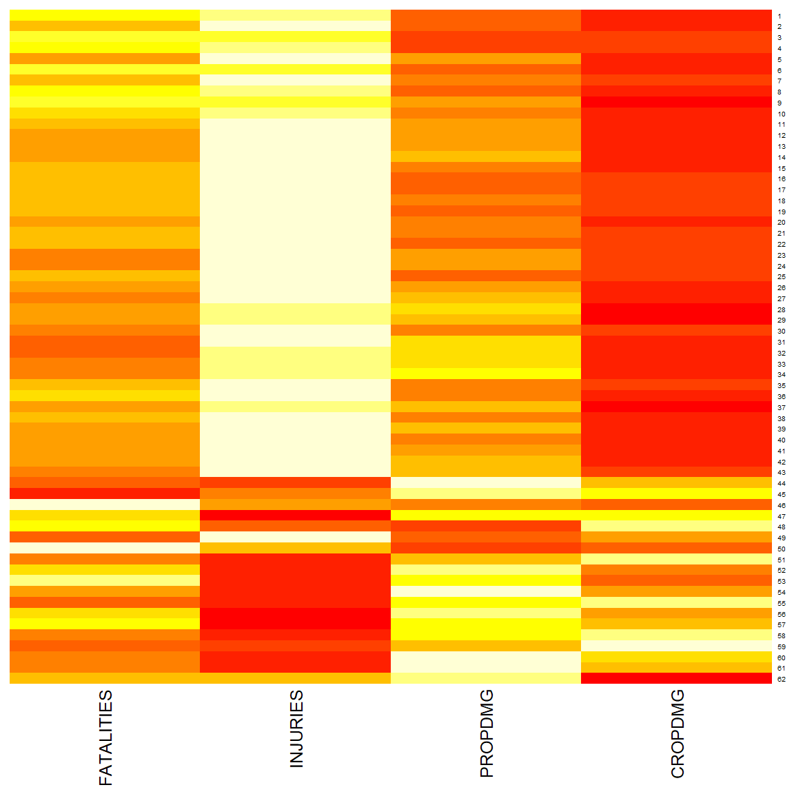
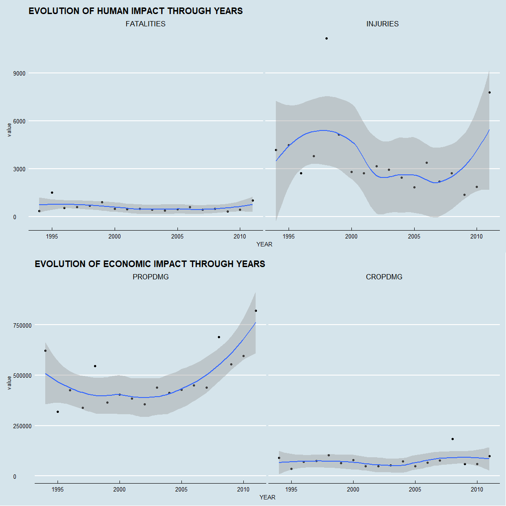
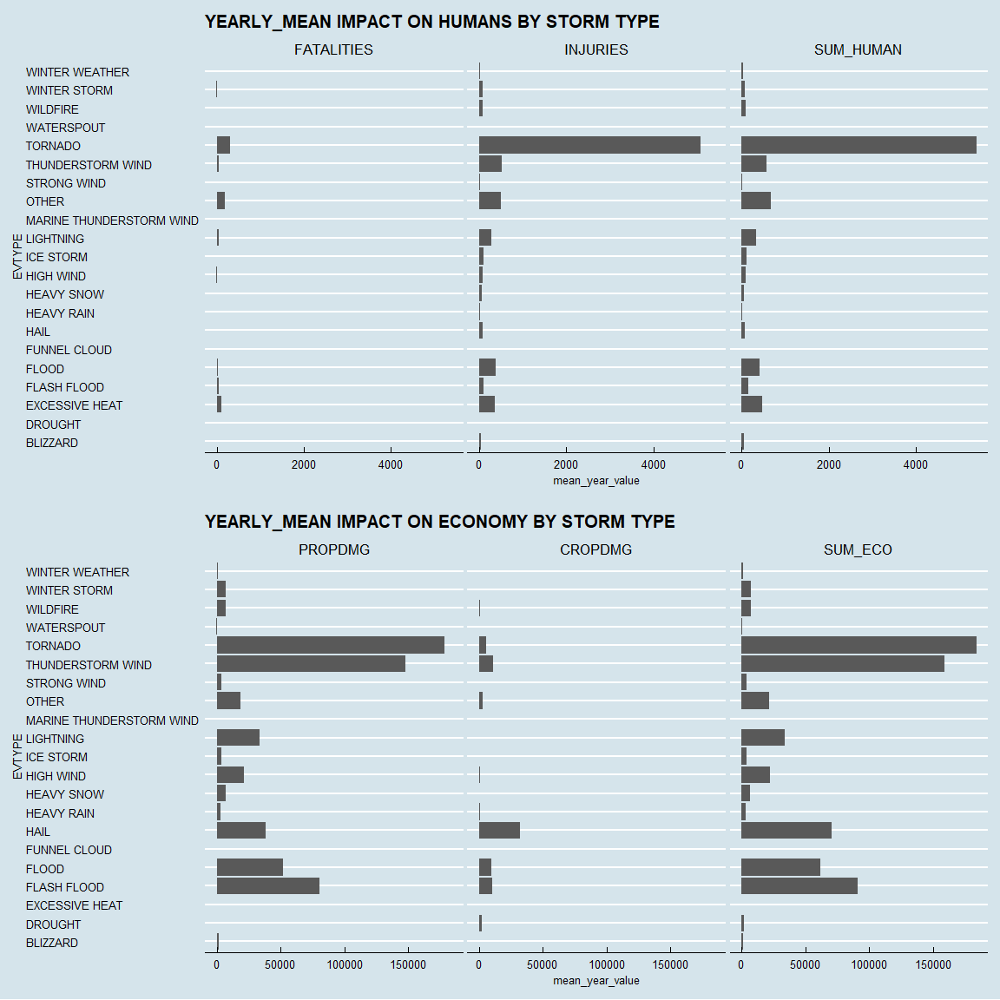

```r
knitr::opts_chunk$set(fig.width=12, fig.height=12) ###to sizing plots
knitr::opts_chunk$set(echo = TRUE) ###To keep code, FALSE if no code in output
```

***
**SYNOPSIS**<br>
"storm" is a data frame extract from NOAA Storm Database, recording information about various types
of storms that happened on the US soil from 1950 to 2011. In the earlier years of the database
there are generally fewer events recorded, most likely due to a lack of good records.
Our aim is to get measurements that enable decision making on resource allocations.
<br><br>
We will show which types of storms are more damaging than others on human health and on economy.
<br><br>
Document summary :<br>
<style>
div.blue { background-color:#e6f0ff; border-radius: 5px; padding: 20px;}
</style>
<div class = "blue">

- LIBRARIES & SETUP
- GETTING THE DATA
- UNIVARIATE DATA EXPLORATION
- DATA PROCESSING
- RESULTS

</div>

***

# LIBRARIES & SETUP


```r
suppressWarnings(suppressMessages(suppressPackageStartupMessages(library(tidyverse))))
suppressWarnings(suppressMessages(suppressPackageStartupMessages(library(magrittr))))
suppressWarnings(suppressMessages(suppressPackageStartupMessages(library(Hmisc))))
suppressWarnings(suppressMessages(suppressPackageStartupMessages(library(funModeling))))
suppressWarnings(suppressMessages(suppressPackageStartupMessages(library(DataExplorer))))
suppressWarnings(suppressMessages(suppressPackageStartupMessages(library(data.table))))
suppressWarnings(suppressMessages(suppressPackageStartupMessages(library(reshape))))
suppressWarnings(suppressMessages(suppressPackageStartupMessages(library(reshape2))))
suppressWarnings(suppressMessages(suppressPackageStartupMessages(library(gridExtra))))
suppressWarnings(suppressMessages(suppressPackageStartupMessages(library(mice))))
suppressWarnings(suppressMessages(suppressPackageStartupMessages(library(knitr))))
suppressWarnings(suppressMessages(suppressPackageStartupMessages(library(kableExtra))))
suppressWarnings(suppressMessages(suppressPackageStartupMessages(library(icon))))
suppressWarnings(suppressMessages(suppressPackageStartupMessages(library(ggthemes))))
options(scipen = 999, digits = 0)
setwd(dir = "C:\\Users\\yousri.hajri\\Documents\\DATA_SCIENCE\\5_REPRODUCIBLE_RESEARCH\\WEEK4")
```


```r
fa_r_project(colour = "#384CB7", size=5)
```

<!--html_preserve--><i class="fab  fa-r-project fa-5x " style="color:#384CB7;"></i><!--/html_preserve-->

```r
sessionInfo()
```

```
## R version 3.4.3 (2017-11-30)
## Platform: x86_64-w64-mingw32/x64 (64-bit)
## Running under: Windows 10 x64 (build 15063)
## 
## Matrix products: default
## 
## locale:
## [1] LC_COLLATE=French_France.1252  LC_CTYPE=French_France.1252   
## [3] LC_MONETARY=French_France.1252 LC_NUMERIC=C                  
## [5] LC_TIME=French_France.1252    
## 
## attached base packages:
## [1] stats     graphics  grDevices utils     datasets  methods   base     
## 
## other attached packages:
##  [1] ggthemes_3.4.0       icon_0.1.0           kableExtra_0.6.1    
##  [4] knitr_1.18           mice_2.46.0          gridExtra_2.3       
##  [7] reshape2_1.4.3       reshape_0.8.7        data.table_1.10.4-3 
## [10] DataExplorer_0.4.0   funModeling_1.6.6    Hmisc_4.0-3         
## [13] Formula_1.2-2        survival_2.41-3      magrittr_1.5        
## [16] forcats_0.2.0        stringr_1.2.0        dplyr_0.7.4         
## [19] purrr_0.2.4          readr_1.1.1          tidyr_0.7.2         
## [22] tibble_1.4.1         ggplot2_2.2.1        tidyverse_1.2.1     
## [25] RevoUtilsMath_10.0.1 RevoUtils_10.0.7     RevoMods_11.0.0     
## [28] MicrosoftML_9.3.0    mrsdeploy_1.1.3      RevoScaleR_9.3.0    
## [31] lattice_0.20-35      rpart_4.1-11        
## 
## loaded via a namespace (and not attached):
##  [1] nlme_3.1-131           bitops_1.0-6           lubridate_1.7.1       
##  [4] RColorBrewer_1.1-2     httr_1.3.1             rprojroot_1.3-2       
##  [7] tools_3.4.3            backports_1.1.2        R6_2.2.2              
## [10] KernSmooth_2.23-15     lazyeval_0.2.1         colorspace_1.3-2      
## [13] nnet_7.3-12            mnormt_1.5-5           moments_0.14          
## [16] curl_3.1               compiler_3.4.3         cli_1.0.0             
## [19] rvest_0.3.2            htmlTable_1.11.2       xml2_1.1.1            
## [22] entropy_1.2.1          caTools_1.17.1         scales_0.5.0.9000     
## [25] checkmate_1.8.5        psych_1.7.8            digest_0.6.13         
## [28] foreign_0.8-69         rmarkdown_1.9.12       base64enc_0.1-3       
## [31] pkgconfig_2.0.1        htmltools_0.3.6        htmlwidgets_1.0       
## [34] rlang_0.1.6            readxl_1.0.0           rstudioapi_0.7        
## [37] bindr_0.1              jsonlite_1.5           gtools_3.5.0          
## [40] acepack_1.4.1          Matrix_1.2-12          Rcpp_0.12.15          
## [43] munsell_0.4.3          stringi_1.1.6          yaml_2.1.16           
## [46] MASS_7.3-47            gplots_3.0.1           plyr_1.8.4            
## [49] grid_3.4.3             parallel_3.4.3         gdata_2.18.0          
## [52] crayon_1.3.4           haven_1.1.1            splines_3.4.3         
## [55] pander_0.6.1           hms_0.4.0              pillar_1.1.0          
## [58] igraph_1.1.2           codetools_0.2-15       glue_1.2.0            
## [61] evaluate_0.10.1        latticeExtra_0.6-28    modelr_0.1.1          
## [64] foreach_1.4.4          networkD3_0.4          cellranger_1.1.0      
## [67] gtable_0.2.0           assertthat_0.2.0       broom_0.4.3           
## [70] viridisLite_0.2.0      CompatibilityAPI_1.1.0 iterators_1.0.9       
## [73] bindrcpp_0.2           cluster_2.0.6          ROCR_1.0-7
```

### Creating FUNCTION_KABLE (for formatting tables on markdown)

```r
FUNCTION_KABLE <- function (TABLE) {
    X <- deparse(substitute(TABLE))
    kable (TABLE, format = "html", row.names = T) %>% 
        kable_styling(bootstrap_options = c("striped", "hover", "condensed", "responsive"),
                      full_width = F, position = "center", font_size=10) %>%
        add_footnote (notation = "symbol", c(paste("TABLE:  ", X))) %>%
        column_spec(column=1, bold = T, border_left = T) %>%
        column_spec(column=2, width = "5cm")
    
}
```


# GETTING THE DATA


```r
storm <- readRDS("storm") ### If you saved once
file = "https://d396qusza40orc.cloudfront.net/repdata%2Fdata%2FStormData.csv.bz2"
if (is.null(storm)) download.file(file, destfile = "storm.zip")
if (is.null(storm))   storm <- read.csv("storm.zip")
if (is.null(storm)) saveRDS(object = storm, file = "storm") ### Remove the condition & use it once
```

### DATA TRANSFORMATION FOR EDA

```r
storm %<>% mutate_if(is.factor, as.character) %>% as.data.table()
```
Preliminary transformation of factors to character and of dataframe to datatable

# EDA UNIVARIATE

###Overall exploration of the data


```r
names (storm) ###PlotStr(storm, type="diagonal")
```

```
##  [1] "STATE__"    "BGN_DATE"   "BGN_TIME"   "TIME_ZONE"  "COUNTY"    
##  [6] "COUNTYNAME" "STATE"      "EVTYPE"     "BGN_RANGE"  "BGN_AZI"   
## [11] "BGN_LOCATI" "END_DATE"   "END_TIME"   "COUNTY_END" "COUNTYENDN"
## [16] "END_RANGE"  "END_AZI"    "END_LOCATI" "LENGTH"     "WIDTH"     
## [21] "F"          "MAG"        "FATALITIES" "INJURIES"   "PROPDMG"   
## [26] "PROPDMGEXP" "CROPDMG"    "CROPDMGEXP" "WFO"        "STATEOFFIC"
## [31] "ZONENAMES"  "LATITUDE"   "LONGITUDE"  "LATITUDE_E" "LONGITUDE_"
## [36] "REMARKS"    "REFNUM"
```


```r
summary(storm)
```

```
##     STATE__     BGN_DATE           BGN_TIME          TIME_ZONE        
##  Min.   : 1   Length:902297      Length:902297      Length:902297     
##  1st Qu.:19   Class :character   Class :character   Class :character  
##  Median :30   Mode  :character   Mode  :character   Mode  :character  
##  Mean   :31                                                           
##  3rd Qu.:45                                                           
##  Max.   :95                                                           
##                                                                       
##      COUNTY     COUNTYNAME           STATE              EVTYPE         
##  Min.   :  0   Length:902297      Length:902297      Length:902297     
##  1st Qu.: 31   Class :character   Class :character   Class :character  
##  Median : 75   Mode  :character   Mode  :character   Mode  :character  
##  Mean   :101                                                           
##  3rd Qu.:131                                                           
##  Max.   :873                                                           
##                                                                        
##    BGN_RANGE      BGN_AZI           BGN_LOCATI          END_DATE        
##  Min.   :   0   Length:902297      Length:902297      Length:902297     
##  1st Qu.:   0   Class :character   Class :character   Class :character  
##  Median :   0   Mode  :character   Mode  :character   Mode  :character  
##  Mean   :   1                                                           
##  3rd Qu.:   1                                                           
##  Max.   :3749                                                           
##                                                                         
##    END_TIME           COUNTY_END COUNTYENDN       END_RANGE  
##  Length:902297      Min.   :0    Mode:logical   Min.   :  0  
##  Class :character   1st Qu.:0    NA's:902297    1st Qu.:  0  
##  Mode  :character   Median :0                   Median :  0  
##                     Mean   :0                   Mean   :  1  
##                     3rd Qu.:0                   3rd Qu.:  0  
##                     Max.   :0                   Max.   :925  
##                                                              
##    END_AZI           END_LOCATI            LENGTH         WIDTH     
##  Length:902297      Length:902297      Min.   :   0   Min.   :   0  
##  Class :character   Class :character   1st Qu.:   0   1st Qu.:   0  
##  Mode  :character   Mode  :character   Median :   0   Median :   0  
##                                        Mean   :   0   Mean   :   8  
##                                        3rd Qu.:   0   3rd Qu.:   0  
##                                        Max.   :2315   Max.   :4400  
##                                                                     
##        F               MAG          FATALITIES     INJURIES   
##  Min.   :0        Min.   :    0   Min.   :  0   Min.   :   0  
##  1st Qu.:0        1st Qu.:    0   1st Qu.:  0   1st Qu.:   0  
##  Median :1        Median :   50   Median :  0   Median :   0  
##  Mean   :1        Mean   :   47   Mean   :  0   Mean   :   0  
##  3rd Qu.:1        3rd Qu.:   75   3rd Qu.:  0   3rd Qu.:   0  
##  Max.   :5        Max.   :22000   Max.   :583   Max.   :1700  
##  NA's   :843563                                               
##     PROPDMG      PROPDMGEXP           CROPDMG     CROPDMGEXP       
##  Min.   :   0   Length:902297      Min.   :  0   Length:902297     
##  1st Qu.:   0   Class :character   1st Qu.:  0   Class :character  
##  Median :   0   Mode  :character   Median :  0   Mode  :character  
##  Mean   :  12                      Mean   :  2                     
##  3rd Qu.:   0                      3rd Qu.:  0                     
##  Max.   :5000                      Max.   :990                     
##                                                                    
##      WFO             STATEOFFIC         ZONENAMES            LATITUDE   
##  Length:902297      Length:902297      Length:902297      Min.   :   0  
##  Class :character   Class :character   Class :character   1st Qu.:2802  
##  Mode  :character   Mode  :character   Mode  :character   Median :3540  
##                                                           Mean   :2875  
##                                                           3rd Qu.:4019  
##                                                           Max.   :9706  
##                                                           NA's   :47    
##    LONGITUDE        LATITUDE_E     LONGITUDE_       REMARKS         
##  Min.   :-14451   Min.   :   0   Min.   :-14455   Length:902297     
##  1st Qu.:  7247   1st Qu.:   0   1st Qu.:     0   Class :character  
##  Median :  8707   Median :   0   Median :     0   Mode  :character  
##  Mean   :  6940   Mean   :1452   Mean   :  3509                     
##  3rd Qu.:  9605   3rd Qu.:3549   3rd Qu.:  8735                     
##  Max.   : 17124   Max.   :9706   Max.   :106220                     
##                   NA's   :40                                        
##      REFNUM      
##  Min.   :     1  
##  1st Qu.:225575  
##  Median :451149  
##  Mean   :451149  
##  3rd Qu.:676723  
##  Max.   :902297  
## 
```


```r
str(storm)
```

```
## Classes 'data.table' and 'data.frame':	902297 obs. of  37 variables:
##  $ STATE__   : num  1 1 1 1 1 1 1 1 1 1 ...
##  $ BGN_DATE  : chr  "4/18/1950 0:00:00" "4/18/1950 0:00:00" "2/20/1951 0:00:00" "6/8/1951 0:00:00" ...
##  $ BGN_TIME  : chr  "0130" "0145" "1600" "0900" ...
##  $ TIME_ZONE : chr  "CST" "CST" "CST" "CST" ...
##  $ COUNTY    : num  97 3 57 89 43 77 9 123 125 57 ...
##  $ COUNTYNAME: chr  "MOBILE" "BALDWIN" "FAYETTE" "MADISON" ...
##  $ STATE     : chr  "AL" "AL" "AL" "AL" ...
##  $ EVTYPE    : chr  "TORNADO" "TORNADO" "TORNADO" "TORNADO" ...
##  $ BGN_RANGE : num  0 0 0 0 0 0 0 0 0 0 ...
##  $ BGN_AZI   : chr  "" "" "" "" ...
##  $ BGN_LOCATI: chr  "" "" "" "" ...
##  $ END_DATE  : chr  "" "" "" "" ...
##  $ END_TIME  : chr  "" "" "" "" ...
##  $ COUNTY_END: num  0 0 0 0 0 0 0 0 0 0 ...
##  $ COUNTYENDN: logi  NA NA NA NA NA NA ...
##  $ END_RANGE : num  0 0 0 0 0 0 0 0 0 0 ...
##  $ END_AZI   : chr  "" "" "" "" ...
##  $ END_LOCATI: chr  "" "" "" "" ...
##  $ LENGTH    : num  14 2 0.1 0 0 1.5 1.5 0 3.3 2.3 ...
##  $ WIDTH     : num  100 150 123 100 150 177 33 33 100 100 ...
##  $ F         : int  3 2 2 2 2 2 2 1 3 3 ...
##  $ MAG       : num  0 0 0 0 0 0 0 0 0 0 ...
##  $ FATALITIES: num  0 0 0 0 0 0 0 0 1 0 ...
##  $ INJURIES  : num  15 0 2 2 2 6 1 0 14 0 ...
##  $ PROPDMG   : num  25 2.5 25 2.5 2.5 2.5 2.5 2.5 25 25 ...
##  $ PROPDMGEXP: chr  "K" "K" "K" "K" ...
##  $ CROPDMG   : num  0 0 0 0 0 0 0 0 0 0 ...
##  $ CROPDMGEXP: chr  "" "" "" "" ...
##  $ WFO       : chr  "" "" "" "" ...
##  $ STATEOFFIC: chr  "" "" "" "" ...
##  $ ZONENAMES : chr  "" "" "" "" ...
##  $ LATITUDE  : num  3040 3042 3340 3458 3412 ...
##  $ LONGITUDE : num  8812 8755 8742 8626 8642 ...
##  $ LATITUDE_E: num  3051 0 0 0 0 ...
##  $ LONGITUDE_: num  8806 0 0 0 0 ...
##  $ REMARKS   : chr  "" "" "" "" ...
##  $ REFNUM    : num  1 2 3 4 5 6 7 8 9 10 ...
##  - attr(*, ".internal.selfref")=<externalptr>
```


```r
object.size(storm)
```

```
## 489396056 bytes
```


```r
FUNCTION_KABLE (df_status(storm, print_results = F))
```

<table class="table table-striped table-hover table-condensed table-responsive" style="font-size: 10px; width: auto !important; margin-left: auto; margin-right: auto;">
<thead><tr>
<th style="text-align:left;">   </th>
   <th style="text-align:left;"> variable </th>
   <th style="text-align:right;"> q_zeros </th>
   <th style="text-align:right;"> p_zeros </th>
   <th style="text-align:right;"> q_na </th>
   <th style="text-align:right;"> p_na </th>
   <th style="text-align:right;"> q_inf </th>
   <th style="text-align:right;"> p_inf </th>
   <th style="text-align:left;"> type </th>
   <th style="text-align:right;"> unique </th>
  </tr></thead>
<tbody>
<tr>
<td style="text-align:left;font-weight: bold;border-left:1px solid;"> 1 </td>
   <td style="text-align:left;width: 5cm; "> STATE__ </td>
   <td style="text-align:right;"> 0 </td>
   <td style="text-align:right;"> 0 </td>
   <td style="text-align:right;"> 0 </td>
   <td style="text-align:right;"> 0 </td>
   <td style="text-align:right;"> 0 </td>
   <td style="text-align:right;"> 0 </td>
   <td style="text-align:left;"> numeric </td>
   <td style="text-align:right;"> 70 </td>
  </tr>
<tr>
<td style="text-align:left;font-weight: bold;border-left:1px solid;"> 2 </td>
   <td style="text-align:left;width: 5cm; "> BGN_DATE </td>
   <td style="text-align:right;"> 0 </td>
   <td style="text-align:right;"> 0 </td>
   <td style="text-align:right;"> 0 </td>
   <td style="text-align:right;"> 0 </td>
   <td style="text-align:right;"> 0 </td>
   <td style="text-align:right;"> 0 </td>
   <td style="text-align:left;"> character </td>
   <td style="text-align:right;"> 16335 </td>
  </tr>
<tr>
<td style="text-align:left;font-weight: bold;border-left:1px solid;"> 3 </td>
   <td style="text-align:left;width: 5cm; "> BGN_TIME </td>
   <td style="text-align:right;"> 0 </td>
   <td style="text-align:right;"> 0 </td>
   <td style="text-align:right;"> 0 </td>
   <td style="text-align:right;"> 0 </td>
   <td style="text-align:right;"> 0 </td>
   <td style="text-align:right;"> 0 </td>
   <td style="text-align:left;"> character </td>
   <td style="text-align:right;"> 3608 </td>
  </tr>
<tr>
<td style="text-align:left;font-weight: bold;border-left:1px solid;"> 4 </td>
   <td style="text-align:left;width: 5cm; "> TIME_ZONE </td>
   <td style="text-align:right;"> 0 </td>
   <td style="text-align:right;"> 0 </td>
   <td style="text-align:right;"> 0 </td>
   <td style="text-align:right;"> 0 </td>
   <td style="text-align:right;"> 0 </td>
   <td style="text-align:right;"> 0 </td>
   <td style="text-align:left;"> character </td>
   <td style="text-align:right;"> 22 </td>
  </tr>
<tr>
<td style="text-align:left;font-weight: bold;border-left:1px solid;"> 5 </td>
   <td style="text-align:left;width: 5cm; "> COUNTY </td>
   <td style="text-align:right;"> 6456 </td>
   <td style="text-align:right;"> 1 </td>
   <td style="text-align:right;"> 0 </td>
   <td style="text-align:right;"> 0 </td>
   <td style="text-align:right;"> 0 </td>
   <td style="text-align:right;"> 0 </td>
   <td style="text-align:left;"> numeric </td>
   <td style="text-align:right;"> 557 </td>
  </tr>
<tr>
<td style="text-align:left;font-weight: bold;border-left:1px solid;"> 6 </td>
   <td style="text-align:left;width: 5cm; "> COUNTYNAME </td>
   <td style="text-align:right;"> 0 </td>
   <td style="text-align:right;"> 0 </td>
   <td style="text-align:right;"> 0 </td>
   <td style="text-align:right;"> 0 </td>
   <td style="text-align:right;"> 0 </td>
   <td style="text-align:right;"> 0 </td>
   <td style="text-align:left;"> character </td>
   <td style="text-align:right;"> 29601 </td>
  </tr>
<tr>
<td style="text-align:left;font-weight: bold;border-left:1px solid;"> 7 </td>
   <td style="text-align:left;width: 5cm; "> STATE </td>
   <td style="text-align:right;"> 0 </td>
   <td style="text-align:right;"> 0 </td>
   <td style="text-align:right;"> 0 </td>
   <td style="text-align:right;"> 0 </td>
   <td style="text-align:right;"> 0 </td>
   <td style="text-align:right;"> 0 </td>
   <td style="text-align:left;"> character </td>
   <td style="text-align:right;"> 72 </td>
  </tr>
<tr>
<td style="text-align:left;font-weight: bold;border-left:1px solid;"> 8 </td>
   <td style="text-align:left;width: 5cm; "> EVTYPE </td>
   <td style="text-align:right;"> 0 </td>
   <td style="text-align:right;"> 0 </td>
   <td style="text-align:right;"> 0 </td>
   <td style="text-align:right;"> 0 </td>
   <td style="text-align:right;"> 0 </td>
   <td style="text-align:right;"> 0 </td>
   <td style="text-align:left;"> character </td>
   <td style="text-align:right;"> 985 </td>
  </tr>
<tr>
<td style="text-align:left;font-weight: bold;border-left:1px solid;"> 9 </td>
   <td style="text-align:left;width: 5cm; "> BGN_RANGE </td>
   <td style="text-align:right;"> 607811 </td>
   <td style="text-align:right;"> 67 </td>
   <td style="text-align:right;"> 0 </td>
   <td style="text-align:right;"> 0 </td>
   <td style="text-align:right;"> 0 </td>
   <td style="text-align:right;"> 0 </td>
   <td style="text-align:left;"> numeric </td>
   <td style="text-align:right;"> 272 </td>
  </tr>
<tr>
<td style="text-align:left;font-weight: bold;border-left:1px solid;"> 10 </td>
   <td style="text-align:left;width: 5cm; "> BGN_AZI </td>
   <td style="text-align:right;"> 0 </td>
   <td style="text-align:right;"> 0 </td>
   <td style="text-align:right;"> 0 </td>
   <td style="text-align:right;"> 0 </td>
   <td style="text-align:right;"> 0 </td>
   <td style="text-align:right;"> 0 </td>
   <td style="text-align:left;"> character </td>
   <td style="text-align:right;"> 35 </td>
  </tr>
<tr>
<td style="text-align:left;font-weight: bold;border-left:1px solid;"> 11 </td>
   <td style="text-align:left;width: 5cm; "> BGN_LOCATI </td>
   <td style="text-align:right;"> 0 </td>
   <td style="text-align:right;"> 0 </td>
   <td style="text-align:right;"> 0 </td>
   <td style="text-align:right;"> 0 </td>
   <td style="text-align:right;"> 0 </td>
   <td style="text-align:right;"> 0 </td>
   <td style="text-align:left;"> character </td>
   <td style="text-align:right;"> 54429 </td>
  </tr>
<tr>
<td style="text-align:left;font-weight: bold;border-left:1px solid;"> 12 </td>
   <td style="text-align:left;width: 5cm; "> END_DATE </td>
   <td style="text-align:right;"> 0 </td>
   <td style="text-align:right;"> 0 </td>
   <td style="text-align:right;"> 0 </td>
   <td style="text-align:right;"> 0 </td>
   <td style="text-align:right;"> 0 </td>
   <td style="text-align:right;"> 0 </td>
   <td style="text-align:left;"> character </td>
   <td style="text-align:right;"> 6663 </td>
  </tr>
<tr>
<td style="text-align:left;font-weight: bold;border-left:1px solid;"> 13 </td>
   <td style="text-align:left;width: 5cm; "> END_TIME </td>
   <td style="text-align:right;"> 0 </td>
   <td style="text-align:right;"> 0 </td>
   <td style="text-align:right;"> 0 </td>
   <td style="text-align:right;"> 0 </td>
   <td style="text-align:right;"> 0 </td>
   <td style="text-align:right;"> 0 </td>
   <td style="text-align:left;"> character </td>
   <td style="text-align:right;"> 3647 </td>
  </tr>
<tr>
<td style="text-align:left;font-weight: bold;border-left:1px solid;"> 14 </td>
   <td style="text-align:left;width: 5cm; "> COUNTY_END </td>
   <td style="text-align:right;"> 902297 </td>
   <td style="text-align:right;"> 100 </td>
   <td style="text-align:right;"> 0 </td>
   <td style="text-align:right;"> 0 </td>
   <td style="text-align:right;"> 0 </td>
   <td style="text-align:right;"> 0 </td>
   <td style="text-align:left;"> numeric </td>
   <td style="text-align:right;"> 1 </td>
  </tr>
<tr>
<td style="text-align:left;font-weight: bold;border-left:1px solid;"> 15 </td>
   <td style="text-align:left;width: 5cm; "> COUNTYENDN </td>
   <td style="text-align:right;"> 0 </td>
   <td style="text-align:right;"> 0 </td>
   <td style="text-align:right;"> 902297 </td>
   <td style="text-align:right;"> 100 </td>
   <td style="text-align:right;"> 0 </td>
   <td style="text-align:right;"> 0 </td>
   <td style="text-align:left;"> logical </td>
   <td style="text-align:right;"> 0 </td>
  </tr>
<tr>
<td style="text-align:left;font-weight: bold;border-left:1px solid;"> 16 </td>
   <td style="text-align:left;width: 5cm; "> END_RANGE </td>
   <td style="text-align:right;"> 733369 </td>
   <td style="text-align:right;"> 81 </td>
   <td style="text-align:right;"> 0 </td>
   <td style="text-align:right;"> 0 </td>
   <td style="text-align:right;"> 0 </td>
   <td style="text-align:right;"> 0 </td>
   <td style="text-align:left;"> numeric </td>
   <td style="text-align:right;"> 266 </td>
  </tr>
<tr>
<td style="text-align:left;font-weight: bold;border-left:1px solid;"> 17 </td>
   <td style="text-align:left;width: 5cm; "> END_AZI </td>
   <td style="text-align:right;"> 0 </td>
   <td style="text-align:right;"> 0 </td>
   <td style="text-align:right;"> 0 </td>
   <td style="text-align:right;"> 0 </td>
   <td style="text-align:right;"> 0 </td>
   <td style="text-align:right;"> 0 </td>
   <td style="text-align:left;"> character </td>
   <td style="text-align:right;"> 24 </td>
  </tr>
<tr>
<td style="text-align:left;font-weight: bold;border-left:1px solid;"> 18 </td>
   <td style="text-align:left;width: 5cm; "> END_LOCATI </td>
   <td style="text-align:right;"> 0 </td>
   <td style="text-align:right;"> 0 </td>
   <td style="text-align:right;"> 0 </td>
   <td style="text-align:right;"> 0 </td>
   <td style="text-align:right;"> 0 </td>
   <td style="text-align:right;"> 0 </td>
   <td style="text-align:left;"> character </td>
   <td style="text-align:right;"> 34506 </td>
  </tr>
<tr>
<td style="text-align:left;font-weight: bold;border-left:1px solid;"> 19 </td>
   <td style="text-align:left;width: 5cm; "> LENGTH </td>
   <td style="text-align:right;"> 850839 </td>
   <td style="text-align:right;"> 94 </td>
   <td style="text-align:right;"> 0 </td>
   <td style="text-align:right;"> 0 </td>
   <td style="text-align:right;"> 0 </td>
   <td style="text-align:right;"> 0 </td>
   <td style="text-align:left;"> numeric </td>
   <td style="text-align:right;"> 568 </td>
  </tr>
<tr>
<td style="text-align:left;font-weight: bold;border-left:1px solid;"> 20 </td>
   <td style="text-align:left;width: 5cm; "> WIDTH </td>
   <td style="text-align:right;"> 841747 </td>
   <td style="text-align:right;"> 93 </td>
   <td style="text-align:right;"> 0 </td>
   <td style="text-align:right;"> 0 </td>
   <td style="text-align:right;"> 0 </td>
   <td style="text-align:right;"> 0 </td>
   <td style="text-align:left;"> numeric </td>
   <td style="text-align:right;"> 293 </td>
  </tr>
<tr>
<td style="text-align:left;font-weight: bold;border-left:1px solid;"> 21 </td>
   <td style="text-align:left;width: 5cm; "> F </td>
   <td style="text-align:right;"> 24993 </td>
   <td style="text-align:right;"> 3 </td>
   <td style="text-align:right;"> 843563 </td>
   <td style="text-align:right;"> 93 </td>
   <td style="text-align:right;"> 0 </td>
   <td style="text-align:right;"> 0 </td>
   <td style="text-align:left;"> integer </td>
   <td style="text-align:right;"> 6 </td>
  </tr>
<tr>
<td style="text-align:left;font-weight: bold;border-left:1px solid;"> 22 </td>
   <td style="text-align:left;width: 5cm; "> MAG </td>
   <td style="text-align:right;"> 366676 </td>
   <td style="text-align:right;"> 41 </td>
   <td style="text-align:right;"> 0 </td>
   <td style="text-align:right;"> 0 </td>
   <td style="text-align:right;"> 0 </td>
   <td style="text-align:right;"> 0 </td>
   <td style="text-align:left;"> numeric </td>
   <td style="text-align:right;"> 226 </td>
  </tr>
<tr>
<td style="text-align:left;font-weight: bold;border-left:1px solid;"> 23 </td>
   <td style="text-align:left;width: 5cm; "> FATALITIES </td>
   <td style="text-align:right;"> 895323 </td>
   <td style="text-align:right;"> 99 </td>
   <td style="text-align:right;"> 0 </td>
   <td style="text-align:right;"> 0 </td>
   <td style="text-align:right;"> 0 </td>
   <td style="text-align:right;"> 0 </td>
   <td style="text-align:left;"> numeric </td>
   <td style="text-align:right;"> 52 </td>
  </tr>
<tr>
<td style="text-align:left;font-weight: bold;border-left:1px solid;"> 24 </td>
   <td style="text-align:left;width: 5cm; "> INJURIES </td>
   <td style="text-align:right;"> 884693 </td>
   <td style="text-align:right;"> 98 </td>
   <td style="text-align:right;"> 0 </td>
   <td style="text-align:right;"> 0 </td>
   <td style="text-align:right;"> 0 </td>
   <td style="text-align:right;"> 0 </td>
   <td style="text-align:left;"> numeric </td>
   <td style="text-align:right;"> 200 </td>
  </tr>
<tr>
<td style="text-align:left;font-weight: bold;border-left:1px solid;"> 25 </td>
   <td style="text-align:left;width: 5cm; "> PROPDMG </td>
   <td style="text-align:right;"> 663123 </td>
   <td style="text-align:right;"> 73 </td>
   <td style="text-align:right;"> 0 </td>
   <td style="text-align:right;"> 0 </td>
   <td style="text-align:right;"> 0 </td>
   <td style="text-align:right;"> 0 </td>
   <td style="text-align:left;"> numeric </td>
   <td style="text-align:right;"> 1390 </td>
  </tr>
<tr>
<td style="text-align:left;font-weight: bold;border-left:1px solid;"> 26 </td>
   <td style="text-align:left;width: 5cm; "> PROPDMGEXP </td>
   <td style="text-align:right;"> 216 </td>
   <td style="text-align:right;"> 0 </td>
   <td style="text-align:right;"> 0 </td>
   <td style="text-align:right;"> 0 </td>
   <td style="text-align:right;"> 0 </td>
   <td style="text-align:right;"> 0 </td>
   <td style="text-align:left;"> character </td>
   <td style="text-align:right;"> 19 </td>
  </tr>
<tr>
<td style="text-align:left;font-weight: bold;border-left:1px solid;"> 27 </td>
   <td style="text-align:left;width: 5cm; "> CROPDMG </td>
   <td style="text-align:right;"> 880198 </td>
   <td style="text-align:right;"> 98 </td>
   <td style="text-align:right;"> 0 </td>
   <td style="text-align:right;"> 0 </td>
   <td style="text-align:right;"> 0 </td>
   <td style="text-align:right;"> 0 </td>
   <td style="text-align:left;"> numeric </td>
   <td style="text-align:right;"> 432 </td>
  </tr>
<tr>
<td style="text-align:left;font-weight: bold;border-left:1px solid;"> 28 </td>
   <td style="text-align:left;width: 5cm; "> CROPDMGEXP </td>
   <td style="text-align:right;"> 19 </td>
   <td style="text-align:right;"> 0 </td>
   <td style="text-align:right;"> 0 </td>
   <td style="text-align:right;"> 0 </td>
   <td style="text-align:right;"> 0 </td>
   <td style="text-align:right;"> 0 </td>
   <td style="text-align:left;"> character </td>
   <td style="text-align:right;"> 9 </td>
  </tr>
<tr>
<td style="text-align:left;font-weight: bold;border-left:1px solid;"> 29 </td>
   <td style="text-align:left;width: 5cm; "> WFO </td>
   <td style="text-align:right;"> 0 </td>
   <td style="text-align:right;"> 0 </td>
   <td style="text-align:right;"> 0 </td>
   <td style="text-align:right;"> 0 </td>
   <td style="text-align:right;"> 0 </td>
   <td style="text-align:right;"> 0 </td>
   <td style="text-align:left;"> character </td>
   <td style="text-align:right;"> 542 </td>
  </tr>
<tr>
<td style="text-align:left;font-weight: bold;border-left:1px solid;"> 30 </td>
   <td style="text-align:left;width: 5cm; "> STATEOFFIC </td>
   <td style="text-align:right;"> 0 </td>
   <td style="text-align:right;"> 0 </td>
   <td style="text-align:right;"> 0 </td>
   <td style="text-align:right;"> 0 </td>
   <td style="text-align:right;"> 0 </td>
   <td style="text-align:right;"> 0 </td>
   <td style="text-align:left;"> character </td>
   <td style="text-align:right;"> 250 </td>
  </tr>
<tr>
<td style="text-align:left;font-weight: bold;border-left:1px solid;"> 31 </td>
   <td style="text-align:left;width: 5cm; "> ZONENAMES </td>
   <td style="text-align:right;"> 0 </td>
   <td style="text-align:right;"> 0 </td>
   <td style="text-align:right;"> 0 </td>
   <td style="text-align:right;"> 0 </td>
   <td style="text-align:right;"> 0 </td>
   <td style="text-align:right;"> 0 </td>
   <td style="text-align:left;"> character </td>
   <td style="text-align:right;"> 25112 </td>
  </tr>
<tr>
<td style="text-align:left;font-weight: bold;border-left:1px solid;"> 32 </td>
   <td style="text-align:left;width: 5cm; "> LATITUDE </td>
   <td style="text-align:right;"> 214172 </td>
   <td style="text-align:right;"> 24 </td>
   <td style="text-align:right;"> 47 </td>
   <td style="text-align:right;"> 0 </td>
   <td style="text-align:right;"> 0 </td>
   <td style="text-align:right;"> 0 </td>
   <td style="text-align:left;"> numeric </td>
   <td style="text-align:right;"> 1780 </td>
  </tr>
<tr>
<td style="text-align:left;font-weight: bold;border-left:1px solid;"> 33 </td>
   <td style="text-align:left;width: 5cm; "> LONGITUDE </td>
   <td style="text-align:right;"> 214173 </td>
   <td style="text-align:right;"> 24 </td>
   <td style="text-align:right;"> 0 </td>
   <td style="text-align:right;"> 0 </td>
   <td style="text-align:right;"> 0 </td>
   <td style="text-align:right;"> 0 </td>
   <td style="text-align:left;"> numeric </td>
   <td style="text-align:right;"> 3841 </td>
  </tr>
<tr>
<td style="text-align:left;font-weight: bold;border-left:1px solid;"> 34 </td>
   <td style="text-align:left;width: 5cm; "> LATITUDE_E </td>
   <td style="text-align:right;"> 554953 </td>
   <td style="text-align:right;"> 62 </td>
   <td style="text-align:right;"> 40 </td>
   <td style="text-align:right;"> 0 </td>
   <td style="text-align:right;"> 0 </td>
   <td style="text-align:right;"> 0 </td>
   <td style="text-align:left;"> numeric </td>
   <td style="text-align:right;"> 1728 </td>
  </tr>
<tr>
<td style="text-align:left;font-weight: bold;border-left:1px solid;"> 35 </td>
   <td style="text-align:left;width: 5cm; "> LONGITUDE_ </td>
   <td style="text-align:right;"> 554953 </td>
   <td style="text-align:right;"> 62 </td>
   <td style="text-align:right;"> 0 </td>
   <td style="text-align:right;"> 0 </td>
   <td style="text-align:right;"> 0 </td>
   <td style="text-align:right;"> 0 </td>
   <td style="text-align:left;"> numeric </td>
   <td style="text-align:right;"> 3778 </td>
  </tr>
<tr>
<td style="text-align:left;font-weight: bold;border-left:1px solid;"> 36 </td>
   <td style="text-align:left;width: 5cm; "> REMARKS </td>
   <td style="text-align:right;"> 0 </td>
   <td style="text-align:right;"> 0 </td>
   <td style="text-align:right;"> 0 </td>
   <td style="text-align:right;"> 0 </td>
   <td style="text-align:right;"> 0 </td>
   <td style="text-align:right;"> 0 </td>
   <td style="text-align:left;"> character </td>
   <td style="text-align:right;"> 436781 </td>
  </tr>
<tr>
<td style="text-align:left;font-weight: bold;border-left:1px solid;"> 37 </td>
   <td style="text-align:left;width: 5cm; "> REFNUM </td>
   <td style="text-align:right;"> 0 </td>
   <td style="text-align:right;"> 0 </td>
   <td style="text-align:right;"> 0 </td>
   <td style="text-align:right;"> 0 </td>
   <td style="text-align:right;"> 0 </td>
   <td style="text-align:right;"> 0 </td>
   <td style="text-align:left;"> numeric </td>
   <td style="text-align:right;"> 902297 </td>
  </tr>
</tbody>
<tfoot><tr>
<td style="padding: 0; border:0;" colspan="100%">
<sup>*</sup> TABLE:   df_status(storm, print_results = F)</td>
</tr></tfoot>
</table>


```r
apply(is.na(storm),2,sum) ###PlotMissing(storm)
```

```
##    STATE__   BGN_DATE   BGN_TIME  TIME_ZONE     COUNTY COUNTYNAME 
##          0          0          0          0          0          0 
##      STATE     EVTYPE  BGN_RANGE    BGN_AZI BGN_LOCATI   END_DATE 
##          0          0          0          0          0          0 
##   END_TIME COUNTY_END COUNTYENDN  END_RANGE    END_AZI END_LOCATI 
##          0          0     902297          0          0          0 
##     LENGTH      WIDTH          F        MAG FATALITIES   INJURIES 
##          0          0     843563          0          0          0 
##    PROPDMG PROPDMGEXP    CROPDMG CROPDMGEXP        WFO STATEOFFIC 
##          0          0          0          0          0          0 
##  ZONENAMES   LATITUDE  LONGITUDE LATITUDE_E LONGITUDE_    REMARKS 
##          0         47          0         40          0          0 
##     REFNUM 
##          0
```


```r
describe(storm[,c("FATALITIES","INJURIES","PROPDMG","CROPDMG")])
```

```
## storm[, c("FATALITIES", "INJURIES", "PROPDMG", "CROPDMG")] 
## 
##  4  Variables      902297  Observations
## ---------------------------------------------------------------------------
## FATALITIES 
##        n  missing distinct     Info     Mean      Gmd      .05      .10 
##   902297        0       52    0.023  0.01678  0.03344        0        0 
##      .25      .50      .75      .90      .95 
##        0        0        0        0        0 
## 
## lowest :   0   1   2   3   4, highest:  99 114 116 158 583
## ---------------------------------------------------------------------------
## INJURIES 
##        n  missing distinct     Info     Mean      Gmd      .05      .10 
##   902297        0      200    0.057   0.1557   0.3101        0        0 
##      .25      .50      .75      .90      .95 
##        0        0        0        0        0 
## 
## lowest :    0    1    2    3    4, highest:  800 1150 1228 1568 1700
## ---------------------------------------------------------------------------
## PROPDMG 
##        n  missing distinct     Info     Mean      Gmd      .05      .10 
##   902297        0     1390    0.603    12.06    22.74      0.0      0.0 
##      .25      .50      .75      .90      .95 
##      0.0      0.0      0.5     15.0     50.0 
## 
## lowest :    0    0    0    0    0, highest: 3200 3500 4410 4800 5000
## ---------------------------------------------------------------------------
## CROPDMG 
##        n  missing distinct     Info     Mean      Gmd      .05      .10 
##   902297        0      432    0.072    1.527    3.036        0        0 
##      .25      .50      .75      .90      .95 
##        0        0        0        0        0 
## 
## lowest :   0   0   0   0   0, highest: 950 975 978 985 990
## ---------------------------------------------------------------------------
```


```r
###Only character variables exploration
###freq <- freq(storm[,c("EVTYPE","STATE","PROPDMGEXP","CROPDMGEXP")], path_out="freq_plots", plot=FALSE)
###BarDiscrete(storm)
###Only numerical variables exploration
###plot <- plot_num(storm, bins=30); plot 
```


```r
FUNCTION_KABLE(profiling_num(storm, print_results = FALSE)) ### More details for numerical
```

<table class="table table-striped table-hover table-condensed table-responsive" style="font-size: 10px; width: auto !important; margin-left: auto; margin-right: auto;">
<thead><tr>
<th style="text-align:left;">   </th>
   <th style="text-align:left;"> variable </th>
   <th style="text-align:right;"> mean </th>
   <th style="text-align:right;"> std_dev </th>
   <th style="text-align:right;"> variation_coef </th>
   <th style="text-align:right;"> p_01 </th>
   <th style="text-align:right;"> p_05 </th>
   <th style="text-align:right;"> p_25 </th>
   <th style="text-align:right;"> p_50 </th>
   <th style="text-align:right;"> p_75 </th>
   <th style="text-align:right;"> p_95 </th>
   <th style="text-align:right;"> p_99 </th>
   <th style="text-align:right;"> skewness </th>
   <th style="text-align:right;"> kurtosis </th>
   <th style="text-align:right;"> iqr </th>
   <th style="text-align:left;"> range_98 </th>
   <th style="text-align:left;"> range_80 </th>
  </tr></thead>
<tbody>
<tr>
<td style="text-align:left;font-weight: bold;border-left:1px solid;"> 1 </td>
   <td style="text-align:left;width: 5cm; "> STATE__ </td>
   <td style="text-align:right;"> 31.20 </td>
   <td style="text-align:right;"> 16.57 </td>
   <td style="text-align:right;"> 0.53 </td>
   <td style="text-align:right;"> 1 </td>
   <td style="text-align:right;"> 5 </td>
   <td style="text-align:right;"> 19 </td>
   <td style="text-align:right;"> 30 </td>
   <td style="text-align:right;"> 45.0 </td>
   <td style="text-align:right;"> 55.0 </td>
   <td style="text-align:right;"> 86.0 </td>
   <td style="text-align:right;"> 0.46 </td>
   <td style="text-align:right;"> 3.7 </td>
   <td style="text-align:right;"> 26.0 </td>
   <td style="text-align:left;"> [1, 86] </td>
   <td style="text-align:left;"> [8, 48] </td>
  </tr>
<tr>
<td style="text-align:left;font-weight: bold;border-left:1px solid;"> 2 </td>
   <td style="text-align:left;width: 5cm; "> COUNTY </td>
   <td style="text-align:right;"> 100.64 </td>
   <td style="text-align:right;"> 107.28 </td>
   <td style="text-align:right;"> 1.07 </td>
   <td style="text-align:right;"> 1 </td>
   <td style="text-align:right;"> 4 </td>
   <td style="text-align:right;"> 31 </td>
   <td style="text-align:right;"> 75 </td>
   <td style="text-align:right;"> 131.0 </td>
   <td style="text-align:right;"> 321.0 </td>
   <td style="text-align:right;"> 530.0 </td>
   <td style="text-align:right;"> 2.67 </td>
   <td style="text-align:right;"> 12.8 </td>
   <td style="text-align:right;"> 100.0 </td>
   <td style="text-align:left;"> [1, 530] </td>
   <td style="text-align:left;"> [10, 193] </td>
  </tr>
<tr>
<td style="text-align:left;font-weight: bold;border-left:1px solid;"> 3 </td>
   <td style="text-align:left;width: 5cm; "> BGN_RANGE </td>
   <td style="text-align:right;"> 1.48 </td>
   <td style="text-align:right;"> 5.48 </td>
   <td style="text-align:right;"> 3.69 </td>
   <td style="text-align:right;"> 0 </td>
   <td style="text-align:right;"> 0 </td>
   <td style="text-align:right;"> 0 </td>
   <td style="text-align:right;"> 0 </td>
   <td style="text-align:right;"> 1.0 </td>
   <td style="text-align:right;"> 8.0 </td>
   <td style="text-align:right;"> 16.0 </td>
   <td style="text-align:right;"> 358.10 </td>
   <td style="text-align:right;"> 242304.4 </td>
   <td style="text-align:right;"> 1.0 </td>
   <td style="text-align:left;"> [0, 16] </td>
   <td style="text-align:left;"> [0, 5] </td>
  </tr>
<tr>
<td style="text-align:left;font-weight: bold;border-left:1px solid;"> 4 </td>
   <td style="text-align:left;width: 5cm; "> COUNTY_END </td>
   <td style="text-align:right;"> 0.00 </td>
   <td style="text-align:right;"> 0.00 </td>
   <td style="text-align:right;"> NaN </td>
   <td style="text-align:right;"> 0 </td>
   <td style="text-align:right;"> 0 </td>
   <td style="text-align:right;"> 0 </td>
   <td style="text-align:right;"> 0 </td>
   <td style="text-align:right;"> 0.0 </td>
   <td style="text-align:right;"> 0.0 </td>
   <td style="text-align:right;"> 0.0 </td>
   <td style="text-align:right;"> NaN </td>
   <td style="text-align:right;"> NaN </td>
   <td style="text-align:right;"> 0.0 </td>
   <td style="text-align:left;"> [0, 0] </td>
   <td style="text-align:left;"> [0, 0] </td>
  </tr>
<tr>
<td style="text-align:left;font-weight: bold;border-left:1px solid;"> 5 </td>
   <td style="text-align:left;width: 5cm; "> COUNTYENDN </td>
   <td style="text-align:right;"> NaN </td>
   <td style="text-align:right;"> NA </td>
   <td style="text-align:right;"> NA </td>
   <td style="text-align:right;"> NA </td>
   <td style="text-align:right;"> NA </td>
   <td style="text-align:right;"> NA </td>
   <td style="text-align:right;"> NA </td>
   <td style="text-align:right;"> NA </td>
   <td style="text-align:right;"> NA </td>
   <td style="text-align:right;"> NA </td>
   <td style="text-align:right;"> NaN </td>
   <td style="text-align:right;"> NaN </td>
   <td style="text-align:right;"> NA </td>
   <td style="text-align:left;"> [NA, NA] </td>
   <td style="text-align:left;"> [NA, NA] </td>
  </tr>
<tr>
<td style="text-align:left;font-weight: bold;border-left:1px solid;"> 6 </td>
   <td style="text-align:left;width: 5cm; "> END_RANGE </td>
   <td style="text-align:right;"> 0.99 </td>
   <td style="text-align:right;"> 3.37 </td>
   <td style="text-align:right;"> 3.42 </td>
   <td style="text-align:right;"> 0 </td>
   <td style="text-align:right;"> 0 </td>
   <td style="text-align:right;"> 0 </td>
   <td style="text-align:right;"> 0 </td>
   <td style="text-align:right;"> 0.0 </td>
   <td style="text-align:right;"> 6.0 </td>
   <td style="text-align:right;"> 15.0 </td>
   <td style="text-align:right;"> 29.47 </td>
   <td style="text-align:right;"> 6338.3 </td>
   <td style="text-align:right;"> 0.0 </td>
   <td style="text-align:left;"> [0, 15] </td>
   <td style="text-align:left;"> [0, 3] </td>
  </tr>
<tr>
<td style="text-align:left;font-weight: bold;border-left:1px solid;"> 7 </td>
   <td style="text-align:left;width: 5cm; "> LENGTH </td>
   <td style="text-align:right;"> 0.23 </td>
   <td style="text-align:right;"> 4.62 </td>
   <td style="text-align:right;"> 20.06 </td>
   <td style="text-align:right;"> 0 </td>
   <td style="text-align:right;"> 0 </td>
   <td style="text-align:right;"> 0 </td>
   <td style="text-align:right;"> 0 </td>
   <td style="text-align:right;"> 0.0 </td>
   <td style="text-align:right;"> 0.1 </td>
   <td style="text-align:right;"> 6.8 </td>
   <td style="text-align:right;"> 346.35 </td>
   <td style="text-align:right;"> 154157.5 </td>
   <td style="text-align:right;"> 0.0 </td>
   <td style="text-align:left;"> [0, 6.8] </td>
   <td style="text-align:left;"> [0, 0] </td>
  </tr>
<tr>
<td style="text-align:left;font-weight: bold;border-left:1px solid;"> 8 </td>
   <td style="text-align:left;width: 5cm; "> WIDTH </td>
   <td style="text-align:right;"> 7.50 </td>
   <td style="text-align:right;"> 61.57 </td>
   <td style="text-align:right;"> 8.21 </td>
   <td style="text-align:right;"> 0 </td>
   <td style="text-align:right;"> 0 </td>
   <td style="text-align:right;"> 0 </td>
   <td style="text-align:right;"> 0 </td>
   <td style="text-align:right;"> 0.0 </td>
   <td style="text-align:right;"> 30.0 </td>
   <td style="text-align:right;"> 200.0 </td>
   <td style="text-align:right;"> 18.93 </td>
   <td style="text-align:right;"> 537.8 </td>
   <td style="text-align:right;"> 0.0 </td>
   <td style="text-align:left;"> [0, 200] </td>
   <td style="text-align:left;"> [0, 0] </td>
  </tr>
<tr>
<td style="text-align:left;font-weight: bold;border-left:1px solid;"> 9 </td>
   <td style="text-align:left;width: 5cm; "> F </td>
   <td style="text-align:right;"> 0.91 </td>
   <td style="text-align:right;"> 1.00 </td>
   <td style="text-align:right;"> 1.10 </td>
   <td style="text-align:right;"> 0 </td>
   <td style="text-align:right;"> 0 </td>
   <td style="text-align:right;"> 0 </td>
   <td style="text-align:right;"> 1 </td>
   <td style="text-align:right;"> 1.0 </td>
   <td style="text-align:right;"> 3.0 </td>
   <td style="text-align:right;"> 4.0 </td>
   <td style="text-align:right;"> 1.07 </td>
   <td style="text-align:right;"> 3.8 </td>
   <td style="text-align:right;"> 1.0 </td>
   <td style="text-align:left;"> [0, 4] </td>
   <td style="text-align:left;"> [0, 2] </td>
  </tr>
<tr>
<td style="text-align:left;font-weight: bold;border-left:1px solid;"> 10 </td>
   <td style="text-align:left;width: 5cm; "> MAG </td>
   <td style="text-align:right;"> 46.90 </td>
   <td style="text-align:right;"> 61.91 </td>
   <td style="text-align:right;"> 1.32 </td>
   <td style="text-align:right;"> 0 </td>
   <td style="text-align:right;"> 0 </td>
   <td style="text-align:right;"> 0 </td>
   <td style="text-align:right;"> 50 </td>
   <td style="text-align:right;"> 75.0 </td>
   <td style="text-align:right;"> 175.0 </td>
   <td style="text-align:right;"> 250.0 </td>
   <td style="text-align:right;"> 51.92 </td>
   <td style="text-align:right;"> 17599.0 </td>
   <td style="text-align:right;"> 75.0 </td>
   <td style="text-align:left;"> [0, 250] </td>
   <td style="text-align:left;"> [0, 100] </td>
  </tr>
<tr>
<td style="text-align:left;font-weight: bold;border-left:1px solid;"> 11 </td>
   <td style="text-align:left;width: 5cm; "> FATALITIES </td>
   <td style="text-align:right;"> 0.02 </td>
   <td style="text-align:right;"> 0.77 </td>
   <td style="text-align:right;"> 45.59 </td>
   <td style="text-align:right;"> 0 </td>
   <td style="text-align:right;"> 0 </td>
   <td style="text-align:right;"> 0 </td>
   <td style="text-align:right;"> 0 </td>
   <td style="text-align:right;"> 0.0 </td>
   <td style="text-align:right;"> 0.0 </td>
   <td style="text-align:right;"> 0.0 </td>
   <td style="text-align:right;"> 520.22 </td>
   <td style="text-align:right;"> 377444.0 </td>
   <td style="text-align:right;"> 0.0 </td>
   <td style="text-align:left;"> [0, 0] </td>
   <td style="text-align:left;"> [0, 0] </td>
  </tr>
<tr>
<td style="text-align:left;font-weight: bold;border-left:1px solid;"> 12 </td>
   <td style="text-align:left;width: 5cm; "> INJURIES </td>
   <td style="text-align:right;"> 0.16 </td>
   <td style="text-align:right;"> 5.43 </td>
   <td style="text-align:right;"> 34.88 </td>
   <td style="text-align:right;"> 0 </td>
   <td style="text-align:right;"> 0 </td>
   <td style="text-align:right;"> 0 </td>
   <td style="text-align:right;"> 0 </td>
   <td style="text-align:right;"> 0.0 </td>
   <td style="text-align:right;"> 0.0 </td>
   <td style="text-align:right;"> 2.0 </td>
   <td style="text-align:right;"> 141.80 </td>
   <td style="text-align:right;"> 30499.4 </td>
   <td style="text-align:right;"> 0.0 </td>
   <td style="text-align:left;"> [0, 2] </td>
   <td style="text-align:left;"> [0, 0] </td>
  </tr>
<tr>
<td style="text-align:left;font-weight: bold;border-left:1px solid;"> 13 </td>
   <td style="text-align:left;width: 5cm; "> PROPDMG </td>
   <td style="text-align:right;"> 12.06 </td>
   <td style="text-align:right;"> 59.48 </td>
   <td style="text-align:right;"> 4.93 </td>
   <td style="text-align:right;"> 0 </td>
   <td style="text-align:right;"> 0 </td>
   <td style="text-align:right;"> 0 </td>
   <td style="text-align:right;"> 0 </td>
   <td style="text-align:right;"> 0.5 </td>
   <td style="text-align:right;"> 50.0 </td>
   <td style="text-align:right;"> 250.0 </td>
   <td style="text-align:right;"> 11.75 </td>
   <td style="text-align:right;"> 413.9 </td>
   <td style="text-align:right;"> 0.5 </td>
   <td style="text-align:left;"> [0, 250] </td>
   <td style="text-align:left;"> [0, 15] </td>
  </tr>
<tr>
<td style="text-align:left;font-weight: bold;border-left:1px solid;"> 14 </td>
   <td style="text-align:left;width: 5cm; "> CROPDMG </td>
   <td style="text-align:right;"> 1.53 </td>
   <td style="text-align:right;"> 22.17 </td>
   <td style="text-align:right;"> 14.52 </td>
   <td style="text-align:right;"> 0 </td>
   <td style="text-align:right;"> 0 </td>
   <td style="text-align:right;"> 0 </td>
   <td style="text-align:right;"> 0 </td>
   <td style="text-align:right;"> 0.0 </td>
   <td style="text-align:right;"> 0.0 </td>
   <td style="text-align:right;"> 20.0 </td>
   <td style="text-align:right;"> 22.22 </td>
   <td style="text-align:right;"> 583.7 </td>
   <td style="text-align:right;"> 0.0 </td>
   <td style="text-align:left;"> [0, 20] </td>
   <td style="text-align:left;"> [0, 0] </td>
  </tr>
<tr>
<td style="text-align:left;font-weight: bold;border-left:1px solid;"> 15 </td>
   <td style="text-align:left;width: 5cm; "> LATITUDE </td>
   <td style="text-align:right;"> 2874.94 </td>
   <td style="text-align:right;"> 1657.65 </td>
   <td style="text-align:right;"> 0.58 </td>
   <td style="text-align:right;"> 0 </td>
   <td style="text-align:right;"> 0 </td>
   <td style="text-align:right;"> 2802 </td>
   <td style="text-align:right;"> 3540 </td>
   <td style="text-align:right;"> 4019.0 </td>
   <td style="text-align:right;"> 4506.0 </td>
   <td style="text-align:right;"> 4752.0 </td>
   <td style="text-align:right;"> -1.02 </td>
   <td style="text-align:right;"> 2.3 </td>
   <td style="text-align:right;"> 1217.0 </td>
   <td style="text-align:left;"> [0, 4752] </td>
   <td style="text-align:left;"> [0, 4318] </td>
  </tr>
<tr>
<td style="text-align:left;font-weight: bold;border-left:1px solid;"> 16 </td>
   <td style="text-align:left;width: 5cm; "> LONGITUDE </td>
   <td style="text-align:right;"> 6939.54 </td>
   <td style="text-align:right;"> 3958.06 </td>
   <td style="text-align:right;"> 0.57 </td>
   <td style="text-align:right;"> 0 </td>
   <td style="text-align:right;"> 0 </td>
   <td style="text-align:right;"> 7247 </td>
   <td style="text-align:right;"> 8707 </td>
   <td style="text-align:right;"> 9605.0 </td>
   <td style="text-align:right;"> 10319.0 </td>
   <td style="text-align:right;"> 11310.0 </td>
   <td style="text-align:right;"> -1.08 </td>
   <td style="text-align:right;"> 2.4 </td>
   <td style="text-align:right;"> 2358.0 </td>
   <td style="text-align:left;"> [0, 11310] </td>
   <td style="text-align:left;"> [0, 10042] </td>
  </tr>
<tr>
<td style="text-align:left;font-weight: bold;border-left:1px solid;"> 17 </td>
   <td style="text-align:left;width: 5cm; "> LATITUDE_E </td>
   <td style="text-align:right;"> 1451.61 </td>
   <td style="text-align:right;"> 1858.73 </td>
   <td style="text-align:right;"> 1.28 </td>
   <td style="text-align:right;"> 0 </td>
   <td style="text-align:right;"> 0 </td>
   <td style="text-align:right;"> 0 </td>
   <td style="text-align:right;"> 0 </td>
   <td style="text-align:right;"> 3549.0 </td>
   <td style="text-align:right;"> 4323.0 </td>
   <td style="text-align:right;"> 4706.0 </td>
   <td style="text-align:right;"> 0.55 </td>
   <td style="text-align:right;"> 1.4 </td>
   <td style="text-align:right;"> 3549.0 </td>
   <td style="text-align:left;"> [0, 4706] </td>
   <td style="text-align:left;"> [0, 4109] </td>
  </tr>
<tr>
<td style="text-align:left;font-weight: bold;border-left:1px solid;"> 18 </td>
   <td style="text-align:left;width: 5cm; "> LONGITUDE_ </td>
   <td style="text-align:right;"> 3509.14 </td>
   <td style="text-align:right;"> 4475.68 </td>
   <td style="text-align:right;"> 1.28 </td>
   <td style="text-align:right;"> 0 </td>
   <td style="text-align:right;"> 0 </td>
   <td style="text-align:right;"> 0 </td>
   <td style="text-align:right;"> 0 </td>
   <td style="text-align:right;"> 8735.0 </td>
   <td style="text-align:right;"> 10041.0 </td>
   <td style="text-align:right;"> 10936.0 </td>
   <td style="text-align:right;"> 0.54 </td>
   <td style="text-align:right;"> 1.7 </td>
   <td style="text-align:right;"> 8735.0 </td>
   <td style="text-align:left;"> [0, 10936] </td>
   <td style="text-align:left;"> [0, 9721] </td>
  </tr>
<tr>
<td style="text-align:left;font-weight: bold;border-left:1px solid;"> 19 </td>
   <td style="text-align:left;width: 5cm; "> REFNUM </td>
   <td style="text-align:right;"> 451149.00 </td>
   <td style="text-align:right;"> 260470.85 </td>
   <td style="text-align:right;"> 0.58 </td>
   <td style="text-align:right;"> 9024 </td>
   <td style="text-align:right;"> 45116 </td>
   <td style="text-align:right;"> 225575 </td>
   <td style="text-align:right;"> 451149 </td>
   <td style="text-align:right;"> 676723.0 </td>
   <td style="text-align:right;"> 857182.2 </td>
   <td style="text-align:right;"> 893274.0 </td>
   <td style="text-align:right;"> 0.00 </td>
   <td style="text-align:right;"> 1.8 </td>
   <td style="text-align:right;"> 451148.0 </td>
   <td style="text-align:left;"> [9023.96, 893274.04] </td>
   <td style="text-align:left;"> [90230.6, 812067.4] </td>
  </tr>
</tbody>
<tfoot><tr>
<td style="padding: 0; border:0;" colspan="100%">
<sup>*</sup> TABLE:   profiling_num(storm, print_results = FALSE)</td>
</tr></tfoot>
</table>


# DATA PROCESSING

###Choosing the best variables to answer the question

```r
storm <- select (storm, STATE,BGN_DATE,EVTYPE,FATALITIES,INJURIES,PROPDMG,CROPDMG)
SetNaTo(storm, list(0L, "unknown")) ###Set NA's to 0 if numerical & to "unknown" if character / no effect
FUNCTION_KABLE(head(storm,15))
```

<table class="table table-striped table-hover table-condensed table-responsive" style="font-size: 10px; width: auto !important; margin-left: auto; margin-right: auto;">
<thead><tr>
<th style="text-align:left;">   </th>
   <th style="text-align:left;"> STATE </th>
   <th style="text-align:left;"> BGN_DATE </th>
   <th style="text-align:left;"> EVTYPE </th>
   <th style="text-align:right;"> FATALITIES </th>
   <th style="text-align:right;"> INJURIES </th>
   <th style="text-align:right;"> PROPDMG </th>
   <th style="text-align:right;"> CROPDMG </th>
  </tr></thead>
<tbody>
<tr>
<td style="text-align:left;font-weight: bold;border-left:1px solid;"> 1 </td>
   <td style="text-align:left;width: 5cm; "> AL </td>
   <td style="text-align:left;"> 4/18/1950 0:00:00 </td>
   <td style="text-align:left;"> TORNADO </td>
   <td style="text-align:right;"> 0 </td>
   <td style="text-align:right;"> 15 </td>
   <td style="text-align:right;"> 25.0 </td>
   <td style="text-align:right;"> 0 </td>
  </tr>
<tr>
<td style="text-align:left;font-weight: bold;border-left:1px solid;"> 2 </td>
   <td style="text-align:left;width: 5cm; "> AL </td>
   <td style="text-align:left;"> 4/18/1950 0:00:00 </td>
   <td style="text-align:left;"> TORNADO </td>
   <td style="text-align:right;"> 0 </td>
   <td style="text-align:right;"> 0 </td>
   <td style="text-align:right;"> 2.5 </td>
   <td style="text-align:right;"> 0 </td>
  </tr>
<tr>
<td style="text-align:left;font-weight: bold;border-left:1px solid;"> 3 </td>
   <td style="text-align:left;width: 5cm; "> AL </td>
   <td style="text-align:left;"> 2/20/1951 0:00:00 </td>
   <td style="text-align:left;"> TORNADO </td>
   <td style="text-align:right;"> 0 </td>
   <td style="text-align:right;"> 2 </td>
   <td style="text-align:right;"> 25.0 </td>
   <td style="text-align:right;"> 0 </td>
  </tr>
<tr>
<td style="text-align:left;font-weight: bold;border-left:1px solid;"> 4 </td>
   <td style="text-align:left;width: 5cm; "> AL </td>
   <td style="text-align:left;"> 6/8/1951 0:00:00 </td>
   <td style="text-align:left;"> TORNADO </td>
   <td style="text-align:right;"> 0 </td>
   <td style="text-align:right;"> 2 </td>
   <td style="text-align:right;"> 2.5 </td>
   <td style="text-align:right;"> 0 </td>
  </tr>
<tr>
<td style="text-align:left;font-weight: bold;border-left:1px solid;"> 5 </td>
   <td style="text-align:left;width: 5cm; "> AL </td>
   <td style="text-align:left;"> 11/15/1951 0:00:00 </td>
   <td style="text-align:left;"> TORNADO </td>
   <td style="text-align:right;"> 0 </td>
   <td style="text-align:right;"> 2 </td>
   <td style="text-align:right;"> 2.5 </td>
   <td style="text-align:right;"> 0 </td>
  </tr>
<tr>
<td style="text-align:left;font-weight: bold;border-left:1px solid;"> 6 </td>
   <td style="text-align:left;width: 5cm; "> AL </td>
   <td style="text-align:left;"> 11/15/1951 0:00:00 </td>
   <td style="text-align:left;"> TORNADO </td>
   <td style="text-align:right;"> 0 </td>
   <td style="text-align:right;"> 6 </td>
   <td style="text-align:right;"> 2.5 </td>
   <td style="text-align:right;"> 0 </td>
  </tr>
<tr>
<td style="text-align:left;font-weight: bold;border-left:1px solid;"> 7 </td>
   <td style="text-align:left;width: 5cm; "> AL </td>
   <td style="text-align:left;"> 11/16/1951 0:00:00 </td>
   <td style="text-align:left;"> TORNADO </td>
   <td style="text-align:right;"> 0 </td>
   <td style="text-align:right;"> 1 </td>
   <td style="text-align:right;"> 2.5 </td>
   <td style="text-align:right;"> 0 </td>
  </tr>
<tr>
<td style="text-align:left;font-weight: bold;border-left:1px solid;"> 8 </td>
   <td style="text-align:left;width: 5cm; "> AL </td>
   <td style="text-align:left;"> 1/22/1952 0:00:00 </td>
   <td style="text-align:left;"> TORNADO </td>
   <td style="text-align:right;"> 0 </td>
   <td style="text-align:right;"> 0 </td>
   <td style="text-align:right;"> 2.5 </td>
   <td style="text-align:right;"> 0 </td>
  </tr>
<tr>
<td style="text-align:left;font-weight: bold;border-left:1px solid;"> 9 </td>
   <td style="text-align:left;width: 5cm; "> AL </td>
   <td style="text-align:left;"> 2/13/1952 0:00:00 </td>
   <td style="text-align:left;"> TORNADO </td>
   <td style="text-align:right;"> 1 </td>
   <td style="text-align:right;"> 14 </td>
   <td style="text-align:right;"> 25.0 </td>
   <td style="text-align:right;"> 0 </td>
  </tr>
<tr>
<td style="text-align:left;font-weight: bold;border-left:1px solid;"> 10 </td>
   <td style="text-align:left;width: 5cm; "> AL </td>
   <td style="text-align:left;"> 2/13/1952 0:00:00 </td>
   <td style="text-align:left;"> TORNADO </td>
   <td style="text-align:right;"> 0 </td>
   <td style="text-align:right;"> 0 </td>
   <td style="text-align:right;"> 25.0 </td>
   <td style="text-align:right;"> 0 </td>
  </tr>
<tr>
<td style="text-align:left;font-weight: bold;border-left:1px solid;"> 11 </td>
   <td style="text-align:left;width: 5cm; "> AL </td>
   <td style="text-align:left;"> 2/13/1952 0:00:00 </td>
   <td style="text-align:left;"> TORNADO </td>
   <td style="text-align:right;"> 0 </td>
   <td style="text-align:right;"> 3 </td>
   <td style="text-align:right;"> 2.5 </td>
   <td style="text-align:right;"> 0 </td>
  </tr>
<tr>
<td style="text-align:left;font-weight: bold;border-left:1px solid;"> 12 </td>
   <td style="text-align:left;width: 5cm; "> AL </td>
   <td style="text-align:left;"> 2/13/1952 0:00:00 </td>
   <td style="text-align:left;"> TORNADO </td>
   <td style="text-align:right;"> 0 </td>
   <td style="text-align:right;"> 3 </td>
   <td style="text-align:right;"> 2.5 </td>
   <td style="text-align:right;"> 0 </td>
  </tr>
<tr>
<td style="text-align:left;font-weight: bold;border-left:1px solid;"> 13 </td>
   <td style="text-align:left;width: 5cm; "> AL </td>
   <td style="text-align:left;"> 2/13/1952 0:00:00 </td>
   <td style="text-align:left;"> TORNADO </td>
   <td style="text-align:right;"> 1 </td>
   <td style="text-align:right;"> 26 </td>
   <td style="text-align:right;"> 250.0 </td>
   <td style="text-align:right;"> 0 </td>
  </tr>
<tr>
<td style="text-align:left;font-weight: bold;border-left:1px solid;"> 14 </td>
   <td style="text-align:left;width: 5cm; "> AL </td>
   <td style="text-align:left;"> 2/29/1952 0:00:00 </td>
   <td style="text-align:left;"> TORNADO </td>
   <td style="text-align:right;"> 0 </td>
   <td style="text-align:right;"> 12 </td>
   <td style="text-align:right;"> 0.0 </td>
   <td style="text-align:right;"> 0 </td>
  </tr>
<tr>
<td style="text-align:left;font-weight: bold;border-left:1px solid;"> 15 </td>
   <td style="text-align:left;width: 5cm; "> AL </td>
   <td style="text-align:left;"> 3/3/1952 0:00:00 </td>
   <td style="text-align:left;"> TORNADO </td>
   <td style="text-align:right;"> 0 </td>
   <td style="text-align:right;"> 6 </td>
   <td style="text-align:right;"> 25.0 </td>
   <td style="text-align:right;"> 0 </td>
  </tr>
</tbody>
<tfoot><tr>
<td style="padding: 0; border:0;" colspan="100%">
<sup>*</sup> TABLE:   head(storm, 15)</td>
</tr></tfoot>
</table>


###Character variables

###Var: EVTYPE cleaning (to minimize OTHER)

```r
storm$EVTYPE %<>% toupper() %>%
    gsub(pattern = "TSTM", replacement = "THUNDERSTORM") %>%
    gsub(pattern = "WINDS", replacement = "WIND") %>%
    gsub(pattern = "/MIX", replacement = "") %>%
    gsub(pattern = "URBAN/SML STREAM FLD", replacement = "FLOOD") %>%
    gsub(pattern = "/HAIL", replacement = "") %>%
    gsub(pattern = "WILD/FOREST FIRE", replacement = "WILDFIRE") %>%
    gsub(pattern = "FLOODING", replacement = "FLOOD")
storm$EVTYPE <- ifelse(storm$EVTYPE %in% freq(storm, "EVTYPE", plot=F)[1:20,]$EVTYPE, 
                           storm$EVTYPE,
                           "OTHER")
storm$EVTYPE %<>% as.factor()
FUNCTION_KABLE(freq(storm, "EVTYPE", plot = FALSE))
```

<table class="table table-striped table-hover table-condensed table-responsive" style="font-size: 10px; width: auto !important; margin-left: auto; margin-right: auto;">
<thead><tr>
<th style="text-align:left;">   </th>
   <th style="text-align:left;"> EVTYPE </th>
   <th style="text-align:right;"> frequency </th>
   <th style="text-align:right;"> percentage </th>
   <th style="text-align:right;"> cumulative_perc </th>
  </tr></thead>
<tbody>
<tr>
<td style="text-align:left;font-weight: bold;border-left:1px solid;"> 1 </td>
   <td style="text-align:left;width: 5cm; "> THUNDERSTORM WIND </td>
   <td style="text-align:right;"> 324408 </td>
   <td style="text-align:right;"> 35.95 </td>
   <td style="text-align:right;"> 36 </td>
  </tr>
<tr>
<td style="text-align:left;font-weight: bold;border-left:1px solid;"> 2 </td>
   <td style="text-align:left;width: 5cm; "> HAIL </td>
   <td style="text-align:right;"> 288661 </td>
   <td style="text-align:right;"> 31.99 </td>
   <td style="text-align:right;"> 68 </td>
  </tr>
<tr>
<td style="text-align:left;font-weight: bold;border-left:1px solid;"> 3 </td>
   <td style="text-align:left;width: 5cm; "> TORNADO </td>
   <td style="text-align:right;"> 60652 </td>
   <td style="text-align:right;"> 6.72 </td>
   <td style="text-align:right;"> 75 </td>
  </tr>
<tr>
<td style="text-align:left;font-weight: bold;border-left:1px solid;"> 4 </td>
   <td style="text-align:left;width: 5cm; "> FLASH FLOOD </td>
   <td style="text-align:right;"> 54959 </td>
   <td style="text-align:right;"> 6.09 </td>
   <td style="text-align:right;"> 81 </td>
  </tr>
<tr>
<td style="text-align:left;font-weight: bold;border-left:1px solid;"> 5 </td>
   <td style="text-align:left;width: 5cm; "> FLOOD </td>
   <td style="text-align:right;"> 28839 </td>
   <td style="text-align:right;"> 3.20 </td>
   <td style="text-align:right;"> 84 </td>
  </tr>
<tr>
<td style="text-align:left;font-weight: bold;border-left:1px solid;"> 6 </td>
   <td style="text-align:left;width: 5cm; "> HIGH WIND </td>
   <td style="text-align:right;"> 21747 </td>
   <td style="text-align:right;"> 2.41 </td>
   <td style="text-align:right;"> 86 </td>
  </tr>
<tr>
<td style="text-align:left;font-weight: bold;border-left:1px solid;"> 7 </td>
   <td style="text-align:left;width: 5cm; "> OTHER </td>
   <td style="text-align:right;"> 20735 </td>
   <td style="text-align:right;"> 2.30 </td>
   <td style="text-align:right;"> 89 </td>
  </tr>
<tr>
<td style="text-align:left;font-weight: bold;border-left:1px solid;"> 8 </td>
   <td style="text-align:left;width: 5cm; "> LIGHTNING </td>
   <td style="text-align:right;"> 15754 </td>
   <td style="text-align:right;"> 1.75 </td>
   <td style="text-align:right;"> 90 </td>
  </tr>
<tr>
<td style="text-align:left;font-weight: bold;border-left:1px solid;"> 9 </td>
   <td style="text-align:left;width: 5cm; "> HEAVY SNOW </td>
   <td style="text-align:right;"> 15708 </td>
   <td style="text-align:right;"> 1.74 </td>
   <td style="text-align:right;"> 92 </td>
  </tr>
<tr>
<td style="text-align:left;font-weight: bold;border-left:1px solid;"> 10 </td>
   <td style="text-align:left;width: 5cm; "> MARINE THUNDERSTORM WIND </td>
   <td style="text-align:right;"> 11987 </td>
   <td style="text-align:right;"> 1.33 </td>
   <td style="text-align:right;"> 93 </td>
  </tr>
<tr>
<td style="text-align:left;font-weight: bold;border-left:1px solid;"> 11 </td>
   <td style="text-align:left;width: 5cm; "> HEAVY RAIN </td>
   <td style="text-align:right;"> 11742 </td>
   <td style="text-align:right;"> 1.30 </td>
   <td style="text-align:right;"> 95 </td>
  </tr>
<tr>
<td style="text-align:left;font-weight: bold;border-left:1px solid;"> 12 </td>
   <td style="text-align:left;width: 5cm; "> WINTER STORM </td>
   <td style="text-align:right;"> 11433 </td>
   <td style="text-align:right;"> 1.27 </td>
   <td style="text-align:right;"> 96 </td>
  </tr>
<tr>
<td style="text-align:left;font-weight: bold;border-left:1px solid;"> 13 </td>
   <td style="text-align:left;width: 5cm; "> WINTER WEATHER </td>
   <td style="text-align:right;"> 8149 </td>
   <td style="text-align:right;"> 0.90 </td>
   <td style="text-align:right;"> 97 </td>
  </tr>
<tr>
<td style="text-align:left;font-weight: bold;border-left:1px solid;"> 14 </td>
   <td style="text-align:left;width: 5cm; "> FUNNEL CLOUD </td>
   <td style="text-align:right;"> 6845 </td>
   <td style="text-align:right;"> 0.76 </td>
   <td style="text-align:right;"> 98 </td>
  </tr>
<tr>
<td style="text-align:left;font-weight: bold;border-left:1px solid;"> 15 </td>
   <td style="text-align:left;width: 5cm; "> WILDFIRE </td>
   <td style="text-align:right;"> 4218 </td>
   <td style="text-align:right;"> 0.47 </td>
   <td style="text-align:right;"> 98 </td>
  </tr>
<tr>
<td style="text-align:left;font-weight: bold;border-left:1px solid;"> 16 </td>
   <td style="text-align:left;width: 5cm; "> WATERSPOUT </td>
   <td style="text-align:right;"> 3796 </td>
   <td style="text-align:right;"> 0.42 </td>
   <td style="text-align:right;"> 99 </td>
  </tr>
<tr>
<td style="text-align:left;font-weight: bold;border-left:1px solid;"> 17 </td>
   <td style="text-align:left;width: 5cm; "> STRONG WIND </td>
   <td style="text-align:right;"> 3773 </td>
   <td style="text-align:right;"> 0.42 </td>
   <td style="text-align:right;"> 99 </td>
  </tr>
<tr>
<td style="text-align:left;font-weight: bold;border-left:1px solid;"> 18 </td>
   <td style="text-align:left;width: 5cm; "> BLIZZARD </td>
   <td style="text-align:right;"> 2719 </td>
   <td style="text-align:right;"> 0.30 </td>
   <td style="text-align:right;"> 99 </td>
  </tr>
<tr>
<td style="text-align:left;font-weight: bold;border-left:1px solid;"> 19 </td>
   <td style="text-align:left;width: 5cm; "> DROUGHT </td>
   <td style="text-align:right;"> 2488 </td>
   <td style="text-align:right;"> 0.28 </td>
   <td style="text-align:right;"> 100 </td>
  </tr>
<tr>
<td style="text-align:left;font-weight: bold;border-left:1px solid;"> 20 </td>
   <td style="text-align:left;width: 5cm; "> ICE STORM </td>
   <td style="text-align:right;"> 2006 </td>
   <td style="text-align:right;"> 0.22 </td>
   <td style="text-align:right;"> 100 </td>
  </tr>
<tr>
<td style="text-align:left;font-weight: bold;border-left:1px solid;"> 21 </td>
   <td style="text-align:left;width: 5cm; "> EXCESSIVE HEAT </td>
   <td style="text-align:right;"> 1678 </td>
   <td style="text-align:right;"> 0.19 </td>
   <td style="text-align:right;"> 100 </td>
  </tr>
</tbody>
<tfoot><tr>
<td style="padding: 0; border:0;" colspan="100%">
<sup>*</sup> TABLE:   freq(storm, "EVTYPE", plot = FALSE)</td>
</tr></tfoot>
</table>


###Var: BGN_DATE transformation into YEAR

```r
storm$BGN_DATE %<>% as.Date.character(format = "%m/%d/%Y %H:%M:%S")
storm$BGN_DATE <- cut(storm$BGN_DATE, breaks="year") %>% year() %>% as.integer()
storm <- dplyr::rename(storm, YEAR=BGN_DATE)
FUNCTION_KABLE(head(storm,15))
```

<table class="table table-striped table-hover table-condensed table-responsive" style="font-size: 10px; width: auto !important; margin-left: auto; margin-right: auto;">
<thead><tr>
<th style="text-align:left;">   </th>
   <th style="text-align:left;"> STATE </th>
   <th style="text-align:right;"> YEAR </th>
   <th style="text-align:left;"> EVTYPE </th>
   <th style="text-align:right;"> FATALITIES </th>
   <th style="text-align:right;"> INJURIES </th>
   <th style="text-align:right;"> PROPDMG </th>
   <th style="text-align:right;"> CROPDMG </th>
  </tr></thead>
<tbody>
<tr>
<td style="text-align:left;font-weight: bold;border-left:1px solid;"> 1 </td>
   <td style="text-align:left;width: 5cm; "> AL </td>
   <td style="text-align:right;"> 1950 </td>
   <td style="text-align:left;"> TORNADO </td>
   <td style="text-align:right;"> 0 </td>
   <td style="text-align:right;"> 15 </td>
   <td style="text-align:right;"> 25.0 </td>
   <td style="text-align:right;"> 0 </td>
  </tr>
<tr>
<td style="text-align:left;font-weight: bold;border-left:1px solid;"> 2 </td>
   <td style="text-align:left;width: 5cm; "> AL </td>
   <td style="text-align:right;"> 1950 </td>
   <td style="text-align:left;"> TORNADO </td>
   <td style="text-align:right;"> 0 </td>
   <td style="text-align:right;"> 0 </td>
   <td style="text-align:right;"> 2.5 </td>
   <td style="text-align:right;"> 0 </td>
  </tr>
<tr>
<td style="text-align:left;font-weight: bold;border-left:1px solid;"> 3 </td>
   <td style="text-align:left;width: 5cm; "> AL </td>
   <td style="text-align:right;"> 1951 </td>
   <td style="text-align:left;"> TORNADO </td>
   <td style="text-align:right;"> 0 </td>
   <td style="text-align:right;"> 2 </td>
   <td style="text-align:right;"> 25.0 </td>
   <td style="text-align:right;"> 0 </td>
  </tr>
<tr>
<td style="text-align:left;font-weight: bold;border-left:1px solid;"> 4 </td>
   <td style="text-align:left;width: 5cm; "> AL </td>
   <td style="text-align:right;"> 1951 </td>
   <td style="text-align:left;"> TORNADO </td>
   <td style="text-align:right;"> 0 </td>
   <td style="text-align:right;"> 2 </td>
   <td style="text-align:right;"> 2.5 </td>
   <td style="text-align:right;"> 0 </td>
  </tr>
<tr>
<td style="text-align:left;font-weight: bold;border-left:1px solid;"> 5 </td>
   <td style="text-align:left;width: 5cm; "> AL </td>
   <td style="text-align:right;"> 1951 </td>
   <td style="text-align:left;"> TORNADO </td>
   <td style="text-align:right;"> 0 </td>
   <td style="text-align:right;"> 2 </td>
   <td style="text-align:right;"> 2.5 </td>
   <td style="text-align:right;"> 0 </td>
  </tr>
<tr>
<td style="text-align:left;font-weight: bold;border-left:1px solid;"> 6 </td>
   <td style="text-align:left;width: 5cm; "> AL </td>
   <td style="text-align:right;"> 1951 </td>
   <td style="text-align:left;"> TORNADO </td>
   <td style="text-align:right;"> 0 </td>
   <td style="text-align:right;"> 6 </td>
   <td style="text-align:right;"> 2.5 </td>
   <td style="text-align:right;"> 0 </td>
  </tr>
<tr>
<td style="text-align:left;font-weight: bold;border-left:1px solid;"> 7 </td>
   <td style="text-align:left;width: 5cm; "> AL </td>
   <td style="text-align:right;"> 1951 </td>
   <td style="text-align:left;"> TORNADO </td>
   <td style="text-align:right;"> 0 </td>
   <td style="text-align:right;"> 1 </td>
   <td style="text-align:right;"> 2.5 </td>
   <td style="text-align:right;"> 0 </td>
  </tr>
<tr>
<td style="text-align:left;font-weight: bold;border-left:1px solid;"> 8 </td>
   <td style="text-align:left;width: 5cm; "> AL </td>
   <td style="text-align:right;"> 1952 </td>
   <td style="text-align:left;"> TORNADO </td>
   <td style="text-align:right;"> 0 </td>
   <td style="text-align:right;"> 0 </td>
   <td style="text-align:right;"> 2.5 </td>
   <td style="text-align:right;"> 0 </td>
  </tr>
<tr>
<td style="text-align:left;font-weight: bold;border-left:1px solid;"> 9 </td>
   <td style="text-align:left;width: 5cm; "> AL </td>
   <td style="text-align:right;"> 1952 </td>
   <td style="text-align:left;"> TORNADO </td>
   <td style="text-align:right;"> 1 </td>
   <td style="text-align:right;"> 14 </td>
   <td style="text-align:right;"> 25.0 </td>
   <td style="text-align:right;"> 0 </td>
  </tr>
<tr>
<td style="text-align:left;font-weight: bold;border-left:1px solid;"> 10 </td>
   <td style="text-align:left;width: 5cm; "> AL </td>
   <td style="text-align:right;"> 1952 </td>
   <td style="text-align:left;"> TORNADO </td>
   <td style="text-align:right;"> 0 </td>
   <td style="text-align:right;"> 0 </td>
   <td style="text-align:right;"> 25.0 </td>
   <td style="text-align:right;"> 0 </td>
  </tr>
<tr>
<td style="text-align:left;font-weight: bold;border-left:1px solid;"> 11 </td>
   <td style="text-align:left;width: 5cm; "> AL </td>
   <td style="text-align:right;"> 1952 </td>
   <td style="text-align:left;"> TORNADO </td>
   <td style="text-align:right;"> 0 </td>
   <td style="text-align:right;"> 3 </td>
   <td style="text-align:right;"> 2.5 </td>
   <td style="text-align:right;"> 0 </td>
  </tr>
<tr>
<td style="text-align:left;font-weight: bold;border-left:1px solid;"> 12 </td>
   <td style="text-align:left;width: 5cm; "> AL </td>
   <td style="text-align:right;"> 1952 </td>
   <td style="text-align:left;"> TORNADO </td>
   <td style="text-align:right;"> 0 </td>
   <td style="text-align:right;"> 3 </td>
   <td style="text-align:right;"> 2.5 </td>
   <td style="text-align:right;"> 0 </td>
  </tr>
<tr>
<td style="text-align:left;font-weight: bold;border-left:1px solid;"> 13 </td>
   <td style="text-align:left;width: 5cm; "> AL </td>
   <td style="text-align:right;"> 1952 </td>
   <td style="text-align:left;"> TORNADO </td>
   <td style="text-align:right;"> 1 </td>
   <td style="text-align:right;"> 26 </td>
   <td style="text-align:right;"> 250.0 </td>
   <td style="text-align:right;"> 0 </td>
  </tr>
<tr>
<td style="text-align:left;font-weight: bold;border-left:1px solid;"> 14 </td>
   <td style="text-align:left;width: 5cm; "> AL </td>
   <td style="text-align:right;"> 1952 </td>
   <td style="text-align:left;"> TORNADO </td>
   <td style="text-align:right;"> 0 </td>
   <td style="text-align:right;"> 12 </td>
   <td style="text-align:right;"> 0.0 </td>
   <td style="text-align:right;"> 0 </td>
  </tr>
<tr>
<td style="text-align:left;font-weight: bold;border-left:1px solid;"> 15 </td>
   <td style="text-align:left;width: 5cm; "> AL </td>
   <td style="text-align:right;"> 1952 </td>
   <td style="text-align:left;"> TORNADO </td>
   <td style="text-align:right;"> 0 </td>
   <td style="text-align:right;"> 6 </td>
   <td style="text-align:right;"> 25.0 </td>
   <td style="text-align:right;"> 0 </td>
  </tr>
</tbody>
<tfoot><tr>
<td style="padding: 0; border:0;" colspan="100%">
<sup>*</sup> TABLE:   head(storm, 15)</td>
</tr></tfoot>
</table>


### Reducing years for incomplete data

```r
options(scipen = 999, digits = 3)
storm_year <- aggregate(.~YEAR, data = select(storm, YEAR,FATALITIES,INJURIES,PROPDMG,CROPDMG), sum)
storm_year_scaled <- select(storm_year, -YEAR) %>% scale(center = FALSE) %>% as.matrix()
heatmap(storm_year_scaled, Rowv = NA, Colv = NA, revC = T, margins = c(10,2))
```

<!-- -->

We remark from the pattern of the data that from 1994 data has changed
We will work only with the newest data (starting from 1994)
More analysis can be done at this point but we will assume that old data is useless 


```r
storm_year %<>% filter(YEAR>1993)
FUNCTION_KABLE(head(storm,15))
```

<table class="table table-striped table-hover table-condensed table-responsive" style="font-size: 10px; width: auto !important; margin-left: auto; margin-right: auto;">
<thead><tr>
<th style="text-align:left;">   </th>
   <th style="text-align:left;"> STATE </th>
   <th style="text-align:right;"> YEAR </th>
   <th style="text-align:left;"> EVTYPE </th>
   <th style="text-align:right;"> FATALITIES </th>
   <th style="text-align:right;"> INJURIES </th>
   <th style="text-align:right;"> PROPDMG </th>
   <th style="text-align:right;"> CROPDMG </th>
  </tr></thead>
<tbody>
<tr>
<td style="text-align:left;font-weight: bold;border-left:1px solid;"> 1 </td>
   <td style="text-align:left;width: 5cm; "> AL </td>
   <td style="text-align:right;"> 1950 </td>
   <td style="text-align:left;"> TORNADO </td>
   <td style="text-align:right;"> 0 </td>
   <td style="text-align:right;"> 15 </td>
   <td style="text-align:right;"> 25.0 </td>
   <td style="text-align:right;"> 0 </td>
  </tr>
<tr>
<td style="text-align:left;font-weight: bold;border-left:1px solid;"> 2 </td>
   <td style="text-align:left;width: 5cm; "> AL </td>
   <td style="text-align:right;"> 1950 </td>
   <td style="text-align:left;"> TORNADO </td>
   <td style="text-align:right;"> 0 </td>
   <td style="text-align:right;"> 0 </td>
   <td style="text-align:right;"> 2.5 </td>
   <td style="text-align:right;"> 0 </td>
  </tr>
<tr>
<td style="text-align:left;font-weight: bold;border-left:1px solid;"> 3 </td>
   <td style="text-align:left;width: 5cm; "> AL </td>
   <td style="text-align:right;"> 1951 </td>
   <td style="text-align:left;"> TORNADO </td>
   <td style="text-align:right;"> 0 </td>
   <td style="text-align:right;"> 2 </td>
   <td style="text-align:right;"> 25.0 </td>
   <td style="text-align:right;"> 0 </td>
  </tr>
<tr>
<td style="text-align:left;font-weight: bold;border-left:1px solid;"> 4 </td>
   <td style="text-align:left;width: 5cm; "> AL </td>
   <td style="text-align:right;"> 1951 </td>
   <td style="text-align:left;"> TORNADO </td>
   <td style="text-align:right;"> 0 </td>
   <td style="text-align:right;"> 2 </td>
   <td style="text-align:right;"> 2.5 </td>
   <td style="text-align:right;"> 0 </td>
  </tr>
<tr>
<td style="text-align:left;font-weight: bold;border-left:1px solid;"> 5 </td>
   <td style="text-align:left;width: 5cm; "> AL </td>
   <td style="text-align:right;"> 1951 </td>
   <td style="text-align:left;"> TORNADO </td>
   <td style="text-align:right;"> 0 </td>
   <td style="text-align:right;"> 2 </td>
   <td style="text-align:right;"> 2.5 </td>
   <td style="text-align:right;"> 0 </td>
  </tr>
<tr>
<td style="text-align:left;font-weight: bold;border-left:1px solid;"> 6 </td>
   <td style="text-align:left;width: 5cm; "> AL </td>
   <td style="text-align:right;"> 1951 </td>
   <td style="text-align:left;"> TORNADO </td>
   <td style="text-align:right;"> 0 </td>
   <td style="text-align:right;"> 6 </td>
   <td style="text-align:right;"> 2.5 </td>
   <td style="text-align:right;"> 0 </td>
  </tr>
<tr>
<td style="text-align:left;font-weight: bold;border-left:1px solid;"> 7 </td>
   <td style="text-align:left;width: 5cm; "> AL </td>
   <td style="text-align:right;"> 1951 </td>
   <td style="text-align:left;"> TORNADO </td>
   <td style="text-align:right;"> 0 </td>
   <td style="text-align:right;"> 1 </td>
   <td style="text-align:right;"> 2.5 </td>
   <td style="text-align:right;"> 0 </td>
  </tr>
<tr>
<td style="text-align:left;font-weight: bold;border-left:1px solid;"> 8 </td>
   <td style="text-align:left;width: 5cm; "> AL </td>
   <td style="text-align:right;"> 1952 </td>
   <td style="text-align:left;"> TORNADO </td>
   <td style="text-align:right;"> 0 </td>
   <td style="text-align:right;"> 0 </td>
   <td style="text-align:right;"> 2.5 </td>
   <td style="text-align:right;"> 0 </td>
  </tr>
<tr>
<td style="text-align:left;font-weight: bold;border-left:1px solid;"> 9 </td>
   <td style="text-align:left;width: 5cm; "> AL </td>
   <td style="text-align:right;"> 1952 </td>
   <td style="text-align:left;"> TORNADO </td>
   <td style="text-align:right;"> 1 </td>
   <td style="text-align:right;"> 14 </td>
   <td style="text-align:right;"> 25.0 </td>
   <td style="text-align:right;"> 0 </td>
  </tr>
<tr>
<td style="text-align:left;font-weight: bold;border-left:1px solid;"> 10 </td>
   <td style="text-align:left;width: 5cm; "> AL </td>
   <td style="text-align:right;"> 1952 </td>
   <td style="text-align:left;"> TORNADO </td>
   <td style="text-align:right;"> 0 </td>
   <td style="text-align:right;"> 0 </td>
   <td style="text-align:right;"> 25.0 </td>
   <td style="text-align:right;"> 0 </td>
  </tr>
<tr>
<td style="text-align:left;font-weight: bold;border-left:1px solid;"> 11 </td>
   <td style="text-align:left;width: 5cm; "> AL </td>
   <td style="text-align:right;"> 1952 </td>
   <td style="text-align:left;"> TORNADO </td>
   <td style="text-align:right;"> 0 </td>
   <td style="text-align:right;"> 3 </td>
   <td style="text-align:right;"> 2.5 </td>
   <td style="text-align:right;"> 0 </td>
  </tr>
<tr>
<td style="text-align:left;font-weight: bold;border-left:1px solid;"> 12 </td>
   <td style="text-align:left;width: 5cm; "> AL </td>
   <td style="text-align:right;"> 1952 </td>
   <td style="text-align:left;"> TORNADO </td>
   <td style="text-align:right;"> 0 </td>
   <td style="text-align:right;"> 3 </td>
   <td style="text-align:right;"> 2.5 </td>
   <td style="text-align:right;"> 0 </td>
  </tr>
<tr>
<td style="text-align:left;font-weight: bold;border-left:1px solid;"> 13 </td>
   <td style="text-align:left;width: 5cm; "> AL </td>
   <td style="text-align:right;"> 1952 </td>
   <td style="text-align:left;"> TORNADO </td>
   <td style="text-align:right;"> 1 </td>
   <td style="text-align:right;"> 26 </td>
   <td style="text-align:right;"> 250.0 </td>
   <td style="text-align:right;"> 0 </td>
  </tr>
<tr>
<td style="text-align:left;font-weight: bold;border-left:1px solid;"> 14 </td>
   <td style="text-align:left;width: 5cm; "> AL </td>
   <td style="text-align:right;"> 1952 </td>
   <td style="text-align:left;"> TORNADO </td>
   <td style="text-align:right;"> 0 </td>
   <td style="text-align:right;"> 12 </td>
   <td style="text-align:right;"> 0.0 </td>
   <td style="text-align:right;"> 0 </td>
  </tr>
<tr>
<td style="text-align:left;font-weight: bold;border-left:1px solid;"> 15 </td>
   <td style="text-align:left;width: 5cm; "> AL </td>
   <td style="text-align:right;"> 1952 </td>
   <td style="text-align:left;"> TORNADO </td>
   <td style="text-align:right;"> 0 </td>
   <td style="text-align:right;"> 6 </td>
   <td style="text-align:right;"> 25.0 </td>
   <td style="text-align:right;"> 0 </td>
  </tr>
</tbody>
<tfoot><tr>
<td style="padding: 0; border:0;" colspan="100%">
<sup>*</sup> TABLE:   head(storm, 15)</td>
</tr></tfoot>
</table>


###Plotting the evolution of damage along the years

```r
storm_year_human <- melt(storm_year, id=c("YEAR")) %>% filter(variable %in% c("FATALITIES","INJURIES"))
plot_human <- ggplot(data = storm_year_human, aes(x = YEAR, y = value)) +
    geom_point() + geom_smooth(method = 'loess') +
    facet_wrap(~variable) +
    theme_economist() +
    labs(title = "EVOLUTION OF HUMAN IMPACT THROUGH YEARS") +
    theme(legend.position = "bottom",
          legend.direction = "horizontal",
          legend.title = element_blank())
storm_year_economic <- melt(storm_year, id=c("YEAR")) %>% filter(variable %in% c("PROPDMG","CROPDMG"))
plot_eco <- ggplot(data = storm_year_economic, aes(x = YEAR, y = value)) +
    geom_point() + geom_smooth(method = 'loess') +
    facet_wrap(~variable) +
    theme_economist() +
    labs(title = "EVOLUTION OF ECONOMIC IMPACT THROUGH YEARS") +
    theme(legend.position = "bottom",
          legend.direction = "horizontal",
          legend.title = element_blank())
###grid
grid.arrange (plot_human, plot_eco, nrow=2)
```

<!-- -->


# RESULTS

###Analysing by EVTYPE from 1994

###Human Analysis Data Prep

```r
storm_evtype_fat <- aggregate(FATALITIES~EVTYPE, storm, sum)
storm_evtype_inj <- aggregate(INJURIES~EVTYPE, storm, sum)
storm_evtype_human <- merge(storm_evtype_fat, storm_evtype_inj, by="EVTYPE")
storm_evtype_human$sum <- apply (storm_evtype_human[,c(2:3)], 1, sum)
storm_evtype_human <- dplyr::rename(storm_evtype_human, SUM_HUMAN=sum)
storm_evtype_human <- melt(data = storm_evtype_human, id=c("EVTYPE"))
storm_evtype_human$mean_year_value <- storm_evtype_human$value/18
plot_human <- ggplot(data = storm_evtype_human, aes(x = EVTYPE, y = mean_year_value)) +
    geom_col() + coord_flip() +
    facet_wrap(~variable) +
    theme_economist() +
    labs(title = "YEARLY_MEAN IMPACT ON HUMANS BY STORM TYPE") +
    theme(legend.position = "bottom",
          legend.direction = "horizontal",
          legend.title = element_blank())
###Economic Analysis Data Prep
storm_evtype_prop <- aggregate(PROPDMG~EVTYPE, storm, sum)
storm_evtype_crop <- aggregate(CROPDMG~EVTYPE, storm, sum)
storm_evtype_eco <- merge(storm_evtype_prop, storm_evtype_crop, by="EVTYPE")
storm_evtype_eco$sum <- apply (storm_evtype_eco[,c(2:3)], 1, sum)
storm_evtype_eco <- dplyr::rename(storm_evtype_eco, SUM_ECO=sum)
storm_evtype_eco <- melt(data = storm_evtype_eco, id=c("EVTYPE"))
storm_evtype_eco$mean_year_value <- storm_evtype_eco$value/18
plot_eco <- ggplot(data = storm_evtype_eco, aes(x = EVTYPE, y = mean_year_value)) +
    geom_col() + coord_flip() +
    facet_wrap(~variable) +
    theme_economist() +
    labs(title = "YEARLY_MEAN IMPACT ON ECONOMY BY STORM TYPE") +
    theme(legend.position = "bottom",
          legend.direction = "horizontal",
          legend.title = element_blank())
###grid
grid.arrange (plot_human, plot_eco, nrow=2)
```

<!-- -->

***
**CONCLUSION**<br>
On average, TORNADO is the most dangerous phnomenon for humans, with about 5000 injuries and 300 deaths per year. Thunderstorm wind and other storms are far less harmful (about 500 injuries & few deaths)
<br>
On average, HAIL is the most harmful storm for crops with 32k$ per year. TORNADO, THUNDERSTORM WIND & FLOODS
are far more damaging for residents properties with about 500k$ per year in sum.

<br><br>

***

